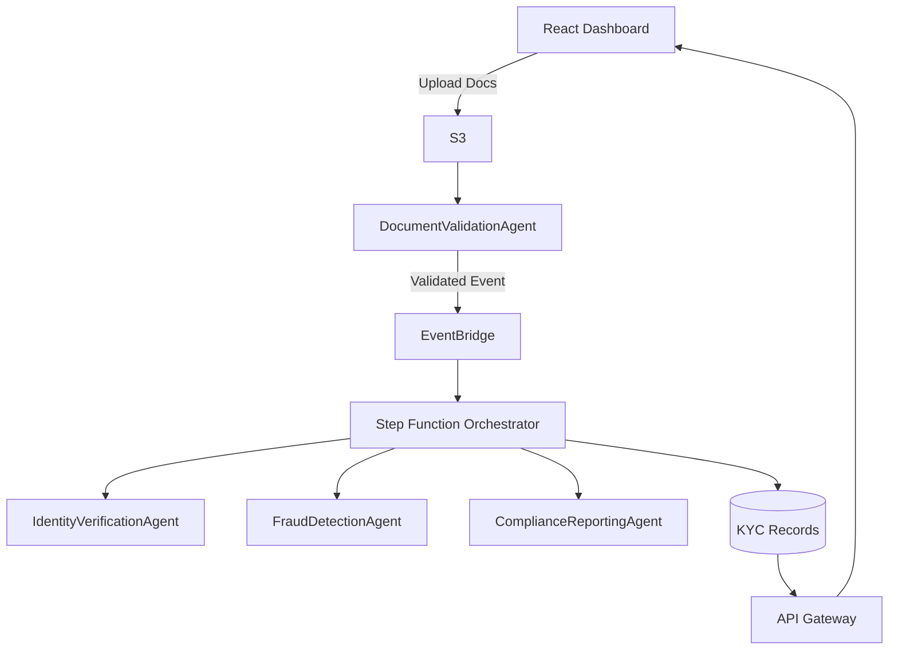

# 🧠 Meta Prompt for Copilot — Agent-Driven Serverless KYC App with AWS UI Dashboard

## 🎯 Role & Context

You are an Enterprise AWS Solutions Architect and AI Systems Engineer applying Spec-Driven Development (SDD).
Design and implement a Serverless, Agent-Driven, Event-Based KYC (Know Your Customer) Platform with a React UI Dashboard hosted entirely in AWS Free Tier–friendly services.

You will produce:
- System specs → architecture → deployable AWS code (backend + frontend).
- All components must align with agent-based, event-oriented and serverless principles.

---

## 🧱 Overall Goal

Deliver a modular, event-driven, serverless KYC platform that enables document upload, validation, verification, fraud detection, and compliance reporting — coordinated through autonomous agents — with a React dashboard to visualize workflow, results, and audit logs.

---

## ⚙️ System Specification

### 1. Core Architecture

**Agents (AWS Lambda):**
- DocumentValidationAgent
- IdentityVerificationAgent
- FraudDetectionAgent
- ComplianceReportingAgent

**Event Bus:** Amazon EventBridge for inter-agent communication.

**Workflow Orchestration:** AWS Step Functions.

**Storage:**
- S3 → Customer documents and processed reports.
- DynamoDB → Customer KYC status, audit records, workflow results.

**Authentication (Optional):** Cognito for secure UI access.

**Logging/Monitoring:** CloudWatch Logs.

### 2. Frontend (Dashboard UI)

- React + Vite or Next.js (choose lightweight).
- Deployed to S3 static hosting + CloudFront distribution.
- Fetches backend data from API Gateway endpoints (proxied to Lambda).

**Features:**
- Upload KYC documents.
- Display current verification status per user.
- View event logs (per agent).
- Trigger re-verification manually.
- Visualize Step Function workflow state (via API).
- Light/Dark theme toggle.

### 3. Event Flow

1. User uploads KYC document via UI → S3.
2. S3 trigger → DocumentValidationAgent.
3. Agent validates and emits Document.Validated event.
4. StepFunction orchestrates IdentityVerificationAgent → FraudDetectionAgent → ComplianceReportingAgent.
5. Final event KYC.Completed updates DynamoDB and UI reflects success.
6. UI polls or subscribes (via API Gateway/Lambda) for updates.

---

## 📜 Specification Format (SDD Sections)

Copilot must generate outputs using Markdown sections in this order:

### 🧭 1. System Overview
Explain system goal and agent-based design.

### 🧱 2. Architecture Diagram


### 🧩 3. Entity & Event Specification (YAML)
```yaml
entities:
  Customer:
    id: string
    name: string
    email: string
    kycStatus: enum [PENDING, VALIDATED, VERIFIED, COMPLETED]
    lastUpdated: timestamp
  KYCEvent:
    id: string
    type: string
    payload: object
    timestamp: timestamp
events:
  - Document.Uploaded
  - Document.Validated
  - Identity.Verified
  - Fraud.Checked
  - Compliance.Completed
  - KYC.Completed
```

### ⚙️ 4. Infrastructure (AWS CDK / SAM)
Generate infrastructure template defining:
- S3 bucket (docs + UI hosting)
- DynamoDB (KYC records)
- EventBridge (event bus + rules)
- Step Functions (state machine)
- Lambda functions (agents)
- API Gateway (REST interface for UI)
- CloudFront (serving UI)

---

## 💻 5. Agent Lambda Specs & Sample Code

Each Lambda agent must:
- Receive input via EventBridge or S3 trigger.
- Perform its task (mock logic or validation).
- Publish the next event to EventBridge.
- Log results to CloudWatch.

**Implementation Language:** Java for Lambda

---

## 🔄 6. Step Function Orchestration

Generate JSON or YAML state machine:

```json
{
  "StartAt": "DocumentValidation",
  "States": {
    "DocumentValidation": {
      "Type": "Task",
      "Resource": "arn:aws:lambda:::function:DocumentValidationAgent",
      "Next": "IdentityVerification"
    },
    "IdentityVerification": {
      "Type": "Task",
      "Resource": "arn:aws:lambda:::function:IdentityVerificationAgent",
      "Next": "FraudDetection"
    },
    "FraudDetection": {
      "Type": "Task",
      "Resource": "arn:aws:lambda:::function:FraudDetectionAgent",
      "Next": "ComplianceReporting"
    },
    "ComplianceReporting": {
      "Type": "Task",
      "Resource": "arn:aws:lambda:::function:ComplianceReportingAgent",
      "End": true
    }
  }
}
```

---

## 🗂️ 7. DynamoDB Schema

**TableName:** KYCRecords

**PartitionKey:** customerId (string)

**SortKey:** eventType (string)

**Attributes:**
- customerId
- kycStatus
- documentUrl
- verificationScore
- lastUpdated

---

## 🖥️ 8. React Dashboard (Frontend Spec)

**Stack:** React + Vite + Tailwind (or Next.js minimal)

**Deployed:** S3 static site + CloudFront + optional Cognito login

**Pages:**
- `/` → Dashboard overview of KYC records (read from API Gateway → Lambda → DynamoDB)
- `/upload` → Upload documents (S3 pre-signed URL via API)
- `/logs` → Display event logs from DynamoDB

**Components:**
- KYCStatusCard → status indicator (Pending, In Progress, Completed)
- UploadForm → upload + metadata
- EventLogTable → real-time logs

**Deployment:**
1. Build React app → `npm run build`
2. Deploy via `aws s3 sync dist/ s3://kyc-ui-dashboard`
3. Serve through CloudFront.

---

## 🚀 9. Deployment Steps

1. `cdk deploy` or `sam deploy` → provision backend.
2. `npm run build` → build UI.
3. `aws s3 sync` → upload UI.
4. Open CloudFront URL → interact with app.

---

## 🧩 10. Extension Ideas

- Integrate Bedrock agents for intelligent verification.
- Use AppSync (GraphQL) for dynamic UI queries.
- Add RAG-based compliance document summarization.
- Enable agent observability via OpenTelemetry.

---

## ✅ Implementation Plan

### Plan: AWS Serverless Agent-Driven KYC Platform

Build a complete event-driven, serverless KYC verification system with autonomous Lambda agents orchestrated by Step Functions, a React dashboard for monitoring/uploads, and EventBridge-based inter-agent communication—all deployable to AWS Free Tier.

### Steps

1. **Initialize project structure** with separate folders for `infrastructure/` (AWS CDK), `backend/` (Java Lambda agents), and `frontend/` (React + Vite dashboard), plus root-level configuration files (`.gitignore`, `README.md`)

2. **Define AWS infrastructure using CDK** in `infrastructure/lib/kyc-stack.ts` covering S3 buckets (documents + UI hosting), DynamoDB table (`KYCRecords`), EventBridge bus, 4 Lambda functions (DocumentValidation, IdentityVerification, FraudDetection, ComplianceReporting), Step Functions state machine, API Gateway REST API, and CloudFront distribution

3. **Implement 4 Java Lambda agent handlers** in `backend/src/main/java/com/kyc/agents/` with each agent (`DocumentValidationAgent.java`, `IdentityVerificationAgent.java`, `FraudDetectionAgent.java`, `ComplianceReportingAgent.java`) processing events, updating DynamoDB, publishing next event to EventBridge, and logging to CloudWatch

4. **Create Step Functions state machine definition** in `infrastructure/statemachine/kyc-workflow.asl.json` orchestrating sequential agent execution (DocumentValidation → IdentityVerification → FraudDetection → ComplianceReporting) with error handling and retry logic

5. **Build React dashboard** in `frontend/src/` with pages for KYC overview (`Dashboard.tsx`), document upload (`Upload.tsx` using S3 presigned URLs), and event logs (`Logs.tsx`), integrating API Gateway endpoints for data fetching and status polling

6. **Configure deployment scripts** with CDK deploy commands for backend infrastructure, Maven build for Java Lambdas, React build + S3 sync for frontend, and verification steps to test end-to-end workflow from document upload through agent processing to dashboard display

### Key Considerations

1. **Language choice for Lambda agents**: use Python for Lambda choice. 

2. **UI authentication approach**: Skip Cognito initially for simpler Free Tier deployment, add API key-based auth via API Gateway - OK 

3. **Event schema validation**: Define EventBridge schema registry for type-safe event contracts between agents 

4. **DynamoDB access pattern**:  separate tables for customers vs. audit logs vs. event history?

---

## Instruction for Copilot

Use the complete specification above to generate a working, end-to-end serverless KYC platform.
Start by building the AWS infrastructure and Lambda agent templates.
Then scaffold the React dashboard and deployment steps.
Ensure all sections align with the Spec-Driven Development model and are deployable on AWS Free Tier.
