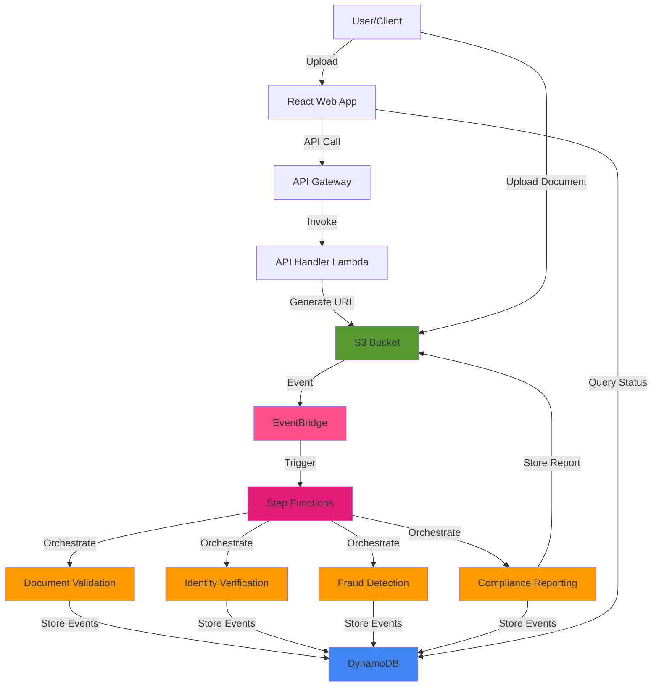
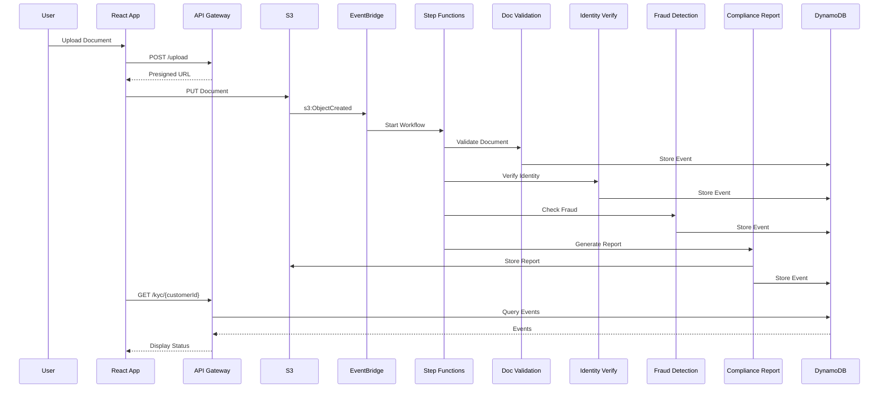
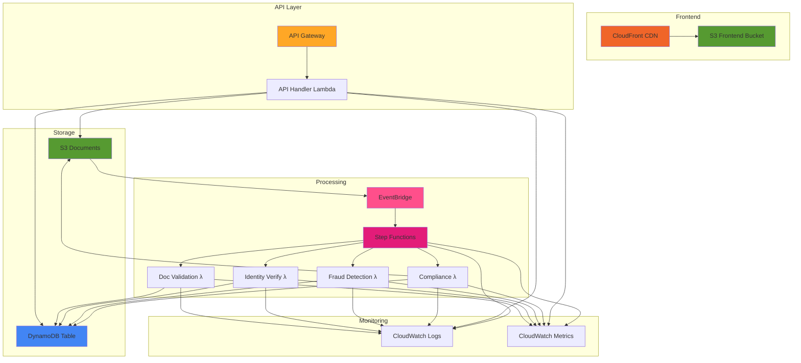
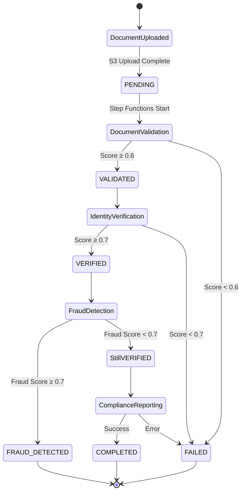

# KYC Platform - Project Summary

## Executive Overview

The **AWS Serverless KYC Platform** is an enterprise-grade, event-driven system for automated Know Your Customer (KYC) verification. Built entirely on AWS serverless technologies, it processes customer identity documents through a multi-stage validation pipeline, ensuring compliance with financial regulations while maintaining high scalability and cost efficiency.

### Key Highlights

- **Architecture**: Event-driven, agent-based serverless system
- **Processing**: Automated 4-stage verification pipeline
- **Scalability**: Auto-scaling from 0 to 1000s of requests
- **Cost Model**: Pay-per-use (no idle infrastructure costs)
- **Deployment**: Single-command infrastructure-as-code deployment
- **Tech Stack**: AWS Lambda, DynamoDB, S3, EventBridge, Step Functions

## System Architecture

### High-Level Overview



### Processing Pipeline



## Technology Stack

### Backend Services

| Component | Technology | Purpose |
|-----------|-----------|---------|
| **Compute** | AWS Lambda (Java 21) | Serverless execution of 4 specialized agents |
| **Build Tool** | Maven 3.9+ | Dependency management and packaging |
| **AWS SDK** | AWS SDK for Java v2.20.0 | AWS service integration |
| **Runtime** | Corretto 21 | Amazon's OpenJDK distribution |

### Frontend Application

| Component | Technology | Version | Purpose |
|-----------|-----------|---------|---------|
| **Framework** | React | 18.x | UI library |
| **Language** | TypeScript | 5.x | Type-safe development |
| **Build Tool** | Vite | 5.x | Fast build and hot reload |
| **Styling** | TailwindCSS | 3.x | Utility-first CSS |
| **State** | TanStack Query | Latest | Data fetching and caching |
| **HTTP** | Axios | Latest | API communication |

### Infrastructure

| Component | Technology | Purpose |
|-----------|-----------|---------|
| **IaC** | AWS CDK (TypeScript) | Infrastructure definition and deployment |
| **Orchestration** | AWS Step Functions | Workflow coordination |
| **Storage** | Amazon S3 | Document and report storage |
| **Database** | Amazon DynamoDB | Event storage and querying |
| **API** | Amazon API Gateway | REST API management |
| **Events** | Amazon EventBridge | Event routing |
| **CDN** | Amazon CloudFront | Frontend distribution |
| **Monitoring** | Amazon CloudWatch | Logs and metrics |

### Development Tools

```yaml
Languages:
  - Java 21 (Backend Lambda agents)
  - TypeScript 5.x (Infrastructure, Frontend)
  - Node.js 20.x (Build tooling)

Package Managers:
  - Maven 3.9+ (Java dependencies)
  - npm/pnpm (Node.js dependencies)

Build Tools:
  - Maven (Backend JAR packaging)
  - Vite (Frontend bundling)
  - AWS CDK CLI (Infrastructure deployment)

Version Control:
  - Git
  - GitHub (GaganGoswami/kyc-serverless)
```

## AWS Services Architecture

### Core Services



### Service Details

**AWS Lambda** (5 functions):
- `ApiHandlerFunction`: REST API implementation (Node.js 20.x)
- `DocumentValidationAgent`: Validates uploaded documents (Java 21)
- `IdentityVerificationAgent`: Verifies customer identity (Java 21)
- `FraudDetectionAgent`: Checks for fraudulent activity (Java 21)
- `ComplianceReportingAgent`: Generates final compliance report (Java 21)

**Amazon S3** (2 buckets):
- `kyc-documents-*`: Document uploads and compliance reports
- `kyc-frontend-*`: React application hosting

**Amazon DynamoDB**:
- Table: `KycEvents`
- Partition Key: `customerId` (String)
- Sort Key: `eventType` (String)
- Attributes: kycStatus, documentUrl, verificationScore, fraudScore, lastUpdated, metadata

**AWS Step Functions**:
- State Machine: `KycWorkflow`
- Type: Standard (durable execution)
- Timeout: 5 minutes
- States: 4 Lambda tasks in sequence

**Amazon EventBridge**:
- Rule: `KycDocumentUploadRule`
- Event Source: S3 (ObjectCreated)
- Target: Step Functions state machine

**Amazon API Gateway**:
- Type: REST API
- Endpoints: 3 (POST /upload, GET /kyc, GET /kyc/{customerId})
- CORS: Enabled
- Throttling: 10,000 req/sec

**Amazon CloudFront**:
- Distribution: Frontend CDN
- Origin: S3 frontend bucket
- HTTPS: Required
- Caching: Default (24 hours)

## Verification Agents

### 1. Document Validation Agent

**Function**: `DocumentValidationAgent.java`  
**Purpose**: Validates document format, quality, and authenticity

```java
Key Features:
- Document format validation (PDF, images)
- Quality assessment (resolution, clarity)
- Basic authenticity checks
- Validation scoring (0.0 - 1.0)

Output:
- Event: "Document.Validated"
- Status: VALIDATED or FAILED
- Score: verificationScore
```

**Processing Logic**:
1. Retrieve document from S3
2. Analyze document properties
3. Generate validation score (simulated: 0.8-0.95)
4. Publish validation event to DynamoDB
5. Update KYC status to VALIDATED

### 2. Identity Verification Agent

**Function**: `IdentityVerificationAgent.java`  
**Purpose**: Verifies customer identity against document

```java
Key Features:
- Identity matching
- Document data extraction
- Cross-reference verification
- Identity confidence scoring

Output:
- Event: "Identity.Verified"
- Status: VERIFIED or FAILED
- Score: verificationScore (higher than validation)
```

**Processing Logic**:
1. Retrieve validation event from DynamoDB
2. Extract identity information from document
3. Perform identity matching (simulated)
4. Generate verification score (simulated: 0.85-0.98)
5. Publish verification event

### 3. Fraud Detection Agent

**Function**: `FraudDetectionAgent.java`  
**Purpose**: Detects potential fraudulent activity

```java
Key Features:
- Fraud pattern analysis
- Risk scoring
- Anomaly detection
- Threshold-based flagging

Output:
- Event: "Fraud.Checked"
- Status: VERIFIED or FRAUD_DETECTED
- Score: fraudScore (lower is better)
```

**Processing Logic**:
1. Retrieve verification event
2. Analyze fraud indicators
3. Generate fraud risk score (simulated: 0.05-0.30)
4. Check against threshold (0.7)
5. Flag if fraud score > threshold
6. Publish fraud check event

### 4. Compliance Reporting Agent

**Function**: `ComplianceReportingAgent.java`  
**Purpose**: Generates final compliance report

```java
Key Features:
- Aggregates all verification data
- Generates comprehensive report
- Stores report in S3
- Updates final KYC status

Output:
- Event: "Compliance.Completed"
- Status: COMPLETED, FRAUD_DETECTED, or FAILED
- Report: Stored in S3
```

**Processing Logic**:
1. Retrieve all previous events (validation, verification, fraud)
2. Compile comprehensive report
3. Generate report file (text format)
4. Store report in S3 (`reports/` prefix)
5. Publish completion event
6. Set final KYC status

## Processing Workflow

### Step Functions State Machine

```json
{
  "Comment": "KYC Verification Workflow",
  "StartAt": "DocumentValidation",
  "TimeoutSeconds": 300,
  "States": {
    "DocumentValidation": {
      "Type": "Task",
      "Resource": "arn:aws:lambda:...:function:DocumentValidationAgent",
      "Next": "IdentityVerification"
    },
    "IdentityVerification": {
      "Type": "Task",
      "Resource": "arn:aws:lambda:...:function:IdentityVerificationAgent",
      "Next": "FraudDetection"
    },
    "FraudDetection": {
      "Type": "Task",
      "Resource": "arn:aws:lambda:...:function:FraudDetectionAgent",
      "Next": "ComplianceReporting"
    },
    "ComplianceReporting": {
      "Type": "Task",
      "Resource": "arn:aws:lambda:...:function:ComplianceReportingAgent",
      "End": true
    }
  }
}
```

### Event Flow



### Data Model

**KYCEvent Structure**:

```typescript
interface KYCEvent {
  customerId: string;          // PK: "customer-001"
  eventType: string;           // SK: "Document.Validated"
  kycStatus: KYCStatus;        // PENDING | VALIDATED | VERIFIED | FRAUD_DETECTED | COMPLETED | FAILED
  documentUrl?: string;        // s3://kyc-documents-.../uploads/...
  verificationScore?: number;  // 0.0 - 1.0
  fraudScore?: number;         // 0.0 - 1.0
  metadata?: string;           // Additional context
  lastUpdated: string;         // ISO 8601 timestamp
}
```

## Frontend Application

### Architecture

**Framework**: React 18 + TypeScript + Vite

**Pages**:
1. **Dashboard**: KYC status overview and recent events
2. **Upload**: Document upload interface with drag-drop
3. **Logs**: Complete event log and audit trail

**Key Features**:
- Real-time status updates
- Document upload with progress tracking
- Event timeline visualization
- Responsive design (mobile-friendly)
- Dark mode support

### API Integration

```typescript
// API Client Configuration
const API_URL = import.meta.env.VITE_API_URL || 'http://localhost:3000';

// Key Operations
1. POST /upload - Get presigned S3 URL
2. PUT {presignedUrl} - Upload document to S3
3. GET /kyc - Fetch all KYC events
4. GET /kyc/{customerId} - Fetch customer events
```

### State Management

```typescript
// TanStack Query for data fetching
const { data, isLoading } = useQuery({
  queryKey: ['kyc-events'],
  queryFn: () => api.get('/kyc'),
  refetchInterval: 5000  // Polling every 5s
});
```

## Deployment

### Prerequisites

```bash
✓ AWS CLI configured with credentials
✓ Node.js 20.x or later
✓ Java 21 (Amazon Corretto)
✓ Maven 3.9+
✓ AWS CDK CLI installed globally
```

### One-Command Deployment

```bash
# Complete deployment (infrastructure + frontend)
./deploy.sh

# This script:
# 1. Builds backend JAR (Maven)
# 2. Deploys infrastructure (CDK)
# 3. Builds frontend (Vite)
# 4. Uploads to S3 with CloudFront invalidation
```

### Manual Step-by-Step

```bash
# 1. Backend Build
cd backend
mvn clean package
cd ..

# 2. Infrastructure Deployment
cd infrastructure
npm install
npm run build
npx cdk deploy --require-approval never
cd ..

# 3. Frontend Deployment
cd frontend
npm install
npm run build

# Upload to S3
BUCKET=$(aws cloudformation describe-stacks --stack-name KycStack \
  --query "Stacks[0].Outputs[?OutputKey=='FrontendBucketName'].OutputValue" \
  --output text)

aws s3 sync dist/ s3://$BUCKET/ --delete

# Invalidate CloudFront
DIST_ID=$(aws cloudformation describe-stacks --stack-name KycStack \
  --query "Stacks[0].Outputs[?OutputKey=='CloudFrontDistributionId'].OutputValue" \
  --output text)

aws cloudfront create-invalidation --distribution-id $DIST_ID --paths "/*"
```

## Infrastructure as Code

### CDK Stack Definition

**File**: `infrastructure/lib/kyc-stack.ts`

**Resources Created**:
1. **S3 Buckets** (2)
   - Documents bucket with EventBridge notifications
   - Frontend bucket with public read access
   
2. **DynamoDB Table**
   - On-demand billing
   - Point-in-time recovery enabled
   
3. **Lambda Functions** (5)
   - API Handler (Node.js 20.x)
   - 4 Java agents (Corretto 21)
   - All with CloudWatch Logs
   
4. **Step Functions State Machine**
   - Sequential Lambda orchestration
   - 5-minute timeout
   
5. **EventBridge Rule**
   - S3 ObjectCreated trigger
   - Routes to Step Functions
   
6. **API Gateway**
   - REST API with CORS
   - 3 resource endpoints
   
7. **CloudFront Distribution**
   - Frontend CDN
   - HTTPS redirect

### Stack Outputs

```yaml
ApiUrl: https://{api-id}.execute-api.{region}.amazonaws.com/prod
FrontendUrl: https://{distribution-id}.cloudfront.net
DocumentsBucketName: kyc-documents-{random}-{region}
FrontendBucketName: kyc-frontend-{random}-{region}
DynamoDBTableName: KycEvents
StepFunctionsArn: arn:aws:states:...
CloudFrontDistributionId: E1234567890ABC
```

## Security & IAM

### IAM Roles

**1. Lambda Execution Roles** (4 Java agents + API handler):
```yaml
Permissions:
  - logs:CreateLogGroup, logs:CreateLogStream, logs:PutLogEvents
  - dynamodb:PutItem, dynamodb:Query, dynamodb:Scan
  - s3:GetObject, s3:PutObject
  - xray:PutTraceSegments, xray:PutTelemetryRecords
```

**2. Step Functions Execution Role**:
```yaml
Permissions:
  - lambda:InvokeFunction (all 4 agents)
  - logs:CreateLogGroup, logs:CreateLogStream, logs:PutLogEvents
```

**3. EventBridge Role**:
```yaml
Permissions:
  - states:StartExecution (Step Functions)
```

**4. CDK Deployment Role** (CloudFormation):
```yaml
Required Permissions:
  - iam:*, lambda:*, s3:*, dynamodb:*
  - apigateway:*, cloudfront:*, events:*
  - states:*, logs:*, cloudformation:*
```

### Encryption

**At Rest**:
- S3: SSE-S3 (AES-256)
- DynamoDB: AWS-managed keys

**In Transit**:
- TLS 1.2+ for all API calls
- HTTPS-only CloudFront distribution

### Network Security

**Current Architecture**: Public Lambda functions (no VPC)

**VPC Enhancement** (optional):
```yaml
VPC Configuration:
  - Private subnets for Lambda functions
  - NAT Gateway for internet access
  - VPC Endpoints for AWS services
  - Security groups for traffic control
```

## Monitoring & Operations

### CloudWatch Metrics

**Key Metrics**:
```yaml
Lambda:
  - Invocations, Errors, Duration, Throttles
  - Concurrent Executions

Step Functions:
  - ExecutionsStarted, ExecutionsFailed
  - ExecutionTime

API Gateway:
  - Count, 4XXError, 5XXError
  - Latency, IntegrationLatency

DynamoDB:
  - ConsumedReadCapacityUnits
  - ConsumedWriteCapacityUnits
  - UserErrors, SystemErrors
```

### CloudWatch Logs

**Log Groups**:
- `/aws/lambda/ApiHandlerFunction`
- `/aws/lambda/DocumentValidationAgent`
- `/aws/lambda/IdentityVerificationAgent`
- `/aws/lambda/FraudDetectionAgent`
- `/aws/lambda/ComplianceReportingAgent`
- `/aws/states/KycWorkflow`

### Monitoring Dashboard

```bash
# View Lambda errors
aws logs filter-log-events \
  --log-group-name /aws/lambda/DocumentValidationAgent \
  --filter-pattern "ERROR" \
  --start-time $(date -u -d '1 hour ago' +%s)000

# Check Step Functions executions
aws stepfunctions list-executions \
  --state-machine-arn arn:aws:states:... \
  --status-filter FAILED \
  --max-results 10
```

### Alarms (Recommended)

```yaml
Lambda Errors:
  Metric: Errors
  Threshold: > 5 in 5 minutes
  Action: SNS notification

API Gateway 5XX:
  Metric: 5XXError
  Threshold: > 10 in 5 minutes
  Action: SNS notification

Step Functions Failures:
  Metric: ExecutionsFailed
  Threshold: > 3 in 10 minutes
  Action: SNS notification
```

## Cost Analysis

### Estimated Monthly Costs

**Scenario**: 10,000 KYC verifications/month

```yaml
Lambda:
  - Requests: 50,000 (5 per verification)
  - Duration: 2 seconds average @ 512 MB
  - Cost: ~$0.50/month

Step Functions:
  - State transitions: 40,000 (4 per workflow)
  - Cost: ~$1.00/month

DynamoDB:
  - On-demand pricing
  - Reads: 100,000 @ $0.25 per million
  - Writes: 50,000 @ $1.25 per million
  - Cost: ~$0.09/month

S3:
  - Storage: 100 GB @ $0.023/GB
  - Requests: 60,000 (PUT + GET)
  - Cost: ~$2.35/month

API Gateway:
  - Requests: 30,000
  - Cost: ~$0.11/month

CloudFront:
  - Data transfer: 10 GB
  - Requests: 50,000
  - Cost: ~$1.00/month

EventBridge:
  - Custom events: 10,000
  - Cost: ~$0.01/month

Total: ~$5-10/month for 10,000 verifications
```

**Cost per Verification**: $0.0005 - $0.001

### Cost Optimization

1. **Enable DynamoDB Auto Scaling** for predictable workloads
2. **Use S3 Intelligent Tiering** for older documents
3. **Implement API Gateway caching** for repeated queries
4. **Set CloudWatch Logs retention** to 7-30 days
5. **Use Lambda Reserved Concurrency** to control costs

## Performance

### Latency Metrics

```yaml
End-to-End Processing:
  - Document upload: 2-5 seconds (depends on file size)
  - Validation: 1-2 seconds
  - Identity verification: 1-2 seconds
  - Fraud detection: 1-2 seconds
  - Compliance reporting: 1-2 seconds
  - Total workflow: 5-10 seconds

API Response Times:
  - GET /kyc: 50-200ms
  - GET /kyc/{customerId}: 50-150ms
  - POST /upload: 100-300ms
```

### Scalability

```yaml
Lambda:
  - Concurrent executions: Up to 1,000 (default)
  - Can request increase to 10,000+

Step Functions:
  - Concurrent executions: Unlimited
  - Execution history: 90 days

DynamoDB:
  - On-demand: Auto-scales to handle traffic
  - Provisioned: Manual scaling required

API Gateway:
  - Default throttle: 10,000 req/sec
  - Burst: 5,000 requests

S3:
  - Virtually unlimited requests
  - 3,500 PUT/s, 5,500 GET/s per prefix
```

### Performance Tuning

1. **Lambda Memory**: Increase to 1024 MB for faster execution
2. **API Caching**: Enable for frequently accessed data
3. **DynamoDB GSI**: Add for complex query patterns
4. **S3 Transfer Acceleration**: For faster uploads
5. **CloudFront Origin Shield**: For popular content

## Testing

### Local Testing

```bash
# Backend unit tests
cd backend
mvn test

# Frontend tests (if configured)
cd frontend
npm test

# Integration tests
./test-api.sh
```

### Manual API Testing

```bash
# Set API URL
export API_URL="https://your-api-id.execute-api.us-east-1.amazonaws.com/prod"

# 1. Get upload URL
curl -X POST $API_URL/upload \
  -H "Content-Type: application/json" \
  -d '{"customerId":"test-001","documentType":"passport"}'

# 2. Upload document (use returned uploadUrl)
curl -X PUT "$UPLOAD_URL" --upload-file ./test-document.pdf

# 3. Check status (wait 10 seconds)
sleep 10
curl $API_URL/kyc/test-001
```

### Automated Testing

```bash
#!/bin/bash
# automated-test.sh

API_URL="https://your-api-url/prod"
CUSTOMER_ID="test-$(date +%s)"

echo "Testing KYC workflow for $CUSTOMER_ID"

# Get upload URL
RESPONSE=$(curl -s -X POST $API_URL/upload \
  -H "Content-Type: application/json" \
  -d "{\"customerId\":\"$CUSTOMER_ID\",\"documentType\":\"passport\"}")

UPLOAD_URL=$(echo $RESPONSE | jq -r '.uploadUrl')

# Upload test document
curl -X PUT "$UPLOAD_URL" --upload-file ./test-passport.pdf

# Wait for processing
sleep 15

# Verify completion
STATUS=$(curl -s $API_URL/kyc/$CUSTOMER_ID | \
  jq -r '.[] | select(.eventType=="Compliance.Completed") | .kycStatus')

if [ "$STATUS" = "COMPLETED" ]; then
  echo "✓ Test passed: KYC completed successfully"
  exit 0
else
  echo "✗ Test failed: KYC status is $STATUS"
  exit 1
fi
```

## Troubleshooting

### Common Issues

**1. Lambda Timeout**:
```
Solution: Increase timeout in CDK (default: 60s, max: 15min)
```

**2. DynamoDB Throttling**:
```
Solution: Check consumed capacity, enable auto-scaling
```

**3. S3 Access Denied**:
```
Solution: Verify IAM role permissions, bucket policies
```

**4. Step Functions Failed**:
```
Solution: Check CloudWatch Logs for specific Lambda errors
```

**5. CORS Errors**:
```
Solution: Verify API Gateway CORS configuration
```

### Debug Commands

```bash
# View recent Lambda errors
aws logs tail /aws/lambda/DocumentValidationAgent --follow

# Check Step Functions execution
aws stepfunctions describe-execution --execution-arn arn:aws:states:...

# Query DynamoDB
aws dynamodb query \
  --table-name KycEvents \
  --key-condition-expression "customerId = :cid" \
  --expression-attribute-values '{":cid":{"S":"customer-001"}}'

# List S3 objects
aws s3 ls s3://kyc-documents-{bucket-id}/uploads/ --recursive
```

## Disaster Recovery

### Backup Strategy

```yaml
DynamoDB:
  - Point-in-time recovery: Enabled (restore to any second in last 35 days)
  - On-demand backups: Manual or scheduled

S3:
  - Versioning: Enable for document bucket
  - Cross-region replication: Optional
  - Lifecycle policies: Archive to Glacier after 90 days

Lambda:
  - Code: Stored in CloudFormation/CDK
  - Redeploy anytime with CDK

Infrastructure:
  - CDK code in version control
  - Can recreate entire stack from code
```

### Recovery Procedures

**Scenario 1: Accidental Stack Deletion**
```bash
# Redeploy from CDK
cd infrastructure
npx cdk deploy
```

**Scenario 2: Data Corruption**
```bash
# Restore DynamoDB from backup
aws dynamodb restore-table-from-backup \
  --target-table-name KycEvents-Restored \
  --backup-arn arn:aws:dynamodb:...
```

**Scenario 3: Region Failure**
```bash
# Deploy to different region
cd infrastructure
npx cdk deploy --context region=us-west-2
```

## Future Enhancements

### Planned Features

1. **Enhanced Security**:
   - API Key authentication
   - AWS Cognito user pools
   - VPC networking for Lambda

2. **Advanced Processing**:
   - ML-based document validation (Amazon Textract)
   - Facial recognition (Amazon Rekognition)
   - Real-time fraud detection

3. **Operational Improvements**:
   - CloudWatch dashboards
   - SNS notifications for failures
   - Automated testing pipeline

4. **Scalability**:
   - Multi-region deployment
   - Caching layer (ElastiCache)
   - GraphQL API (AppSync)

5. **Compliance**:
   - Audit logging to S3
   - Encryption at rest (KMS)
   - GDPR compliance features

## Documentation Index

| # | Document | Description |
|---|----------|-------------|
| 00 | [Project Summary](./00-project-summary.md) | This document - complete overview |
| 01 | [Architecture Overview](./01-architecture-overview.md) | System architecture and diagrams |
| 02 | [Quick Start](./02-quick-start.md) | Fast deployment guide |
| 06 | [AWS Services](./06-aws-services.md) | Complete AWS services reference |
| 07 | [Backend Services](./07-backend-services.md) | Java Lambda agents documentation |
| 09 | [API Reference](./09-api-reference.md) | Complete API documentation |
| 11 | [Operating Manual](./11-operating-manual.md) | Day-to-day operations |
| 14 | [Security & IAM](./14-security-iam.md) | Security best practices |

## Support & Resources

### Repository

```
GitHub: https://github.com/GaganGoswami/kyc-serverless
```

### AWS Documentation

- [AWS Lambda](https://docs.aws.amazon.com/lambda/)
- [AWS Step Functions](https://docs.aws.amazon.com/step-functions/)
- [Amazon DynamoDB](https://docs.aws.amazon.com/dynamodb/)
- [Amazon S3](https://docs.aws.amazon.com/s3/)
- [AWS CDK](https://docs.aws.amazon.com/cdk/)

### Contact

For questions or support, please open an issue on GitHub.

---

**Last Updated**: January 2025  
**Version**: 1.0  
**License**: MIT
