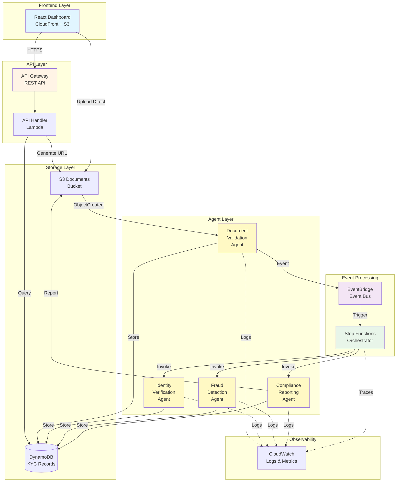
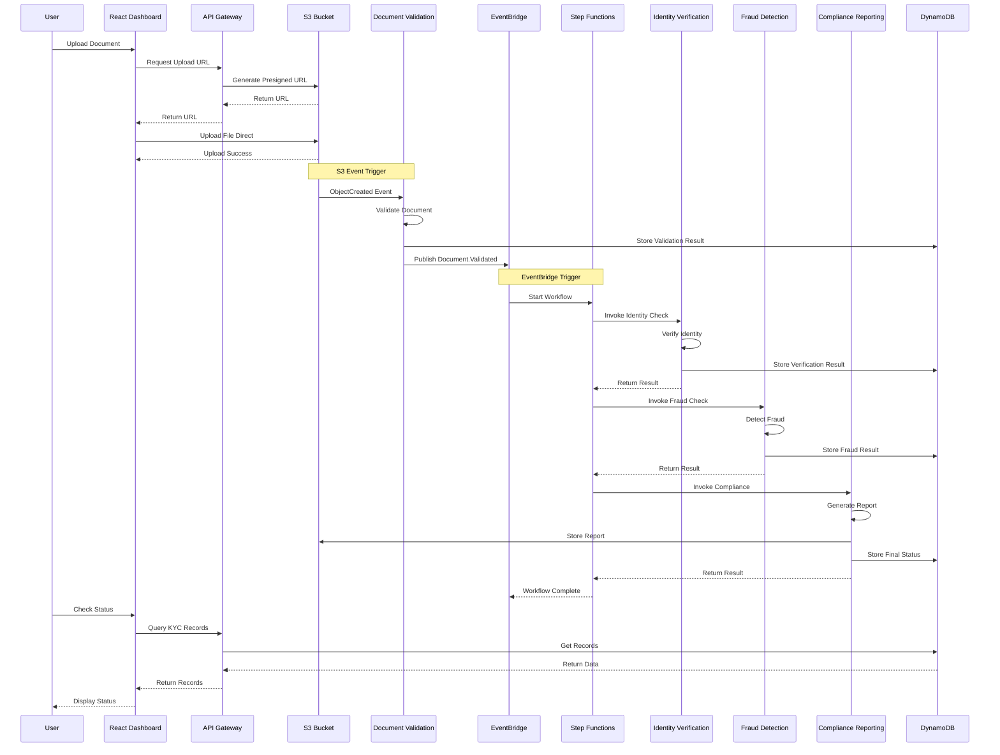
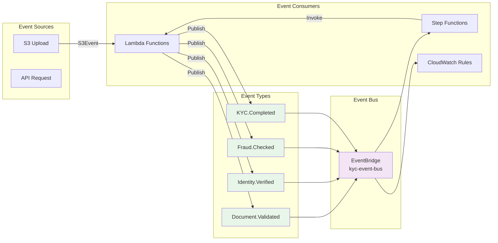
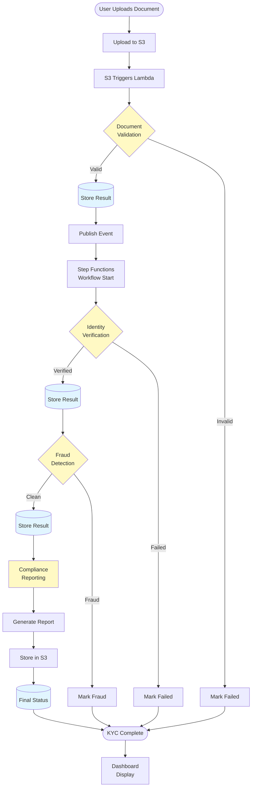
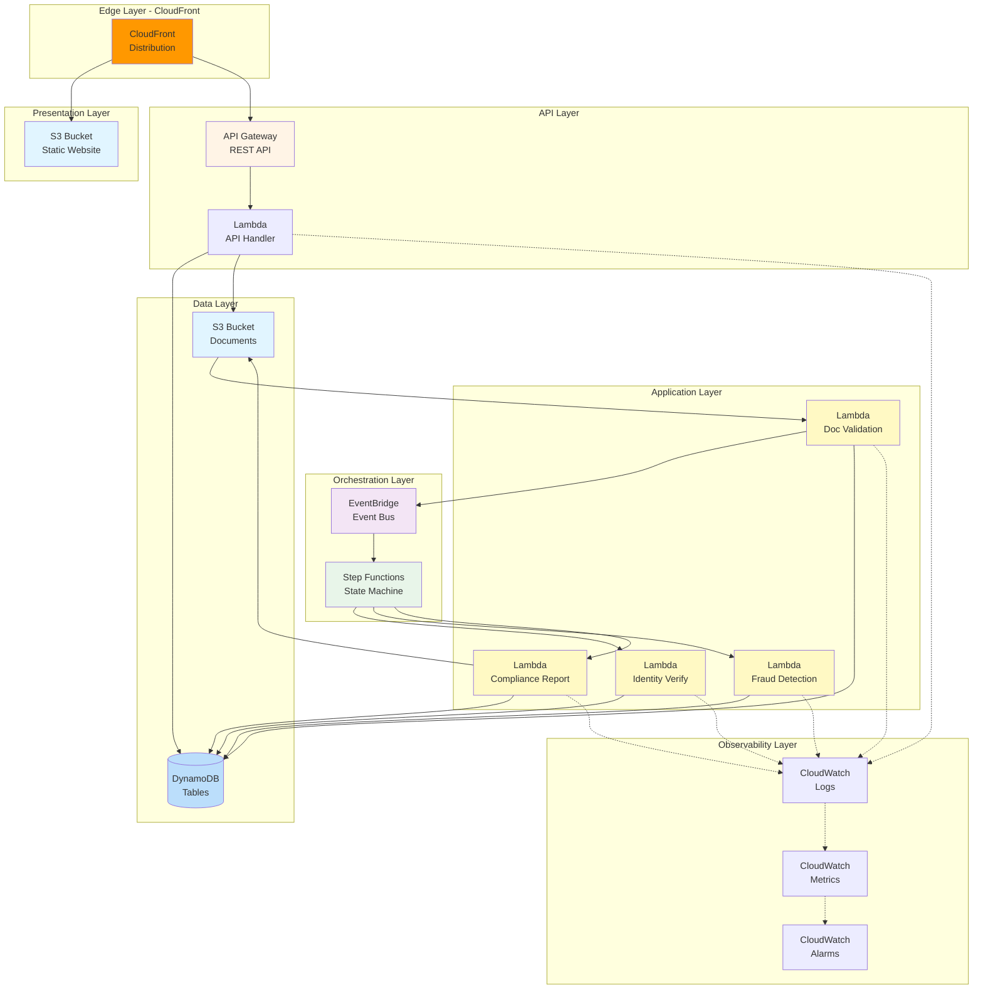

# Architecture Overview

## Table of Contents
- [System Overview](#system-overview)
- [Architecture Diagrams](#architecture-diagrams)
- [Component Details](#component-details)
- [Event Flow](#event-flow)
- [Design Principles](#design-principles)

## System Overview

The AWS Serverless KYC Platform is an **event-driven, agent-based system** that automates Know Your Customer (KYC) verification workflows. It leverages AWS serverless services to provide a scalable, cost-effective, and maintainable solution for document verification and identity management.

### Key Characteristics

- **Event-Driven**: All components communicate asynchronously via EventBridge
- **Serverless**: No servers to manage; AWS handles infrastructure
- **Agent-Based**: Four specialized Lambda functions handle specific KYC tasks
- **Decoupled**: Components are loosely coupled for better maintainability
- **Scalable**: Auto-scales based on demand
- **Observable**: Complete logging and monitoring via CloudWatch

## Architecture Diagrams

### High-Level System Architecture



### KYC Workflow Sequence



### Event-Driven Architecture



### Data Flow Architecture



### Infrastructure Architecture



## Component Details

### 1. Frontend Layer

**React Dashboard** (Hosted on CloudFront + S3)
- **Purpose**: User interface for document uploads and status monitoring
- **Technology**: React 18, TypeScript, TailwindCSS, Vite
- **Features**:
  - Document upload interface
  - Real-time status dashboard
  - Event log viewer
  - Dark mode support
- **Hosting**: S3 static website with CloudFront CDN
- **Performance**: Global edge caching, HTTPS redirect

### 2. API Layer

**API Gateway** (REST API)
- **Purpose**: Expose backend functionality to frontend
- **Endpoints**:
  - `POST /upload` - Generate presigned S3 upload URL
  - `GET /kyc` - List all KYC records
  - `GET /kyc/{customerId}` - Get specific customer records
- **Features**:
  - CORS enabled for cross-origin requests
  - Request/response logging
  - Throttling and rate limiting
  - CloudWatch metrics

**API Handler Lambda**
- **Purpose**: Process API requests and interact with AWS services
- **Runtime**: Node.js 18
- **Operations**:
  - Query DynamoDB for KYC records
  - Generate S3 presigned upload URLs
  - Return formatted responses

### 3. Agent Layer (Lambda Functions)

#### Document Validation Agent
- **Runtime**: Java 21
- **Trigger**: S3 ObjectCreated event
- **Responsibilities**:
  - Validate file format (PDF, JPEG, PNG)
  - Check file size limits
  - Extract metadata
  - Calculate validation score
  - Publish `Document.Validated` event

#### Identity Verification Agent
- **Runtime**: Java 21
- **Trigger**: Step Functions invocation
- **Responsibilities**:
  - Extract document information
  - Cross-reference with databases
  - Validate personal information
  - Calculate verification score
  - Publish `Identity.Verified` event

#### Fraud Detection Agent
- **Runtime**: Java 21
- **Trigger**: Step Functions invocation
- **Responsibilities**:
  - Analyze document for tampering
  - Check fraud databases
  - Detect suspicious patterns
  - Calculate risk score
  - Publish `Fraud.Checked` event

#### Compliance Reporting Agent
- **Runtime**: Java 21
- **Trigger**: Step Functions invocation
- **Responsibilities**:
  - Aggregate all verification results
  - Generate comprehensive report
  - Store report in S3
  - Update final KYC status
  - Publish `KYC.Completed` event

### 4. Orchestration Layer

**EventBridge Event Bus**
- **Name**: `kyc-event-bus`
- **Purpose**: Central event routing and communication
- **Event Types**:
  - `Document.Validated`
  - `Identity.Verified`
  - `Fraud.Checked`
  - `KYC.Completed`
- **Rules**: Trigger Step Functions on `Document.Validated`

**Step Functions State Machine**
- **Name**: `KycWorkflow`
- **Purpose**: Orchestrate multi-step KYC process
- **States**:
  1. Document Validation (check if valid)
  2. Identity Verification (check if verified)
  3. Fraud Detection (check for fraud)
  4. Compliance Reporting (generate final report)
- **Features**:
  - Retry logic with exponential backoff
  - Error catching and handling
  - Workflow visualization
  - Execution history

### 5. Data Layer

**DynamoDB Table** (`KYCRecords`)
- **Schema**:
  - Partition Key: `customerId` (String)
  - Sort Key: `eventType` (String)
- **Attributes**:
  - `kycStatus`: PENDING | VALIDATED | VERIFIED | COMPLETED | FAILED | FRAUD_DETECTED
  - `documentUrl`: S3 URL of document
  - `verificationScore`: Numeric score (0-1)
  - `fraudScore`: Risk score (0-1)
  - `lastUpdated`: ISO timestamp
  - `metadata`: Additional information
- **GSI**: `KycStatusIndex` (for querying by status)
- **Features**:
  - On-demand billing
  - Point-in-time recovery
  - Encryption at rest
  - DynamoDB Streams

**S3 Buckets**

1. **Documents Bucket** (`kyc-documents-*`)
   - Purpose: Store customer documents and reports
   - Structure:
     - `/uploads/{customerId}/{timestamp}-{documentType}`
     - `/reports/{customerId}/compliance-report-{timestamp}.txt`
   - Features:
     - Versioning enabled
     - Server-side encryption (SSE-S3)
     - Lifecycle policies (90-day expiration)
     - CORS enabled

2. **UI Bucket** (`kyc-ui-*`)
   - Purpose: Host React application
   - Features:
     - Static website hosting
     - CloudFront origin access identity
     - Block public access

### 6. Observability Layer

**CloudWatch Logs**
- Lambda function logs (7-day retention)
- API Gateway access logs
- Step Functions execution logs

**CloudWatch Metrics**
- Lambda invocations, errors, duration
- API Gateway requests, latency, errors
- DynamoDB read/write capacity
- Step Functions executions, failures

**CloudWatch Alarms** (Optional)
- Lambda error rate > 5%
- API Gateway 5xx errors
- Step Functions failed executions

## Event Flow

### 1. Document Upload Flow
```
User → React UI → API Gateway → Lambda (presigned URL) → S3 Direct Upload
```

### 2. Validation Flow
```
S3 Upload → Document Validation Agent → DynamoDB → EventBridge
```

### 3. Orchestration Flow
```
EventBridge → Step Functions → [Identity → Fraud → Compliance] → DynamoDB
```

### 4. Query Flow
```
User → React UI → API Gateway → Lambda → DynamoDB → React UI
```

## Design Principles

### 1. Event-Driven Architecture
- **Loose Coupling**: Components don't directly call each other
- **Asynchronous**: Non-blocking communication
- **Scalable**: Each component scales independently
- **Resilient**: Failures don't cascade

### 2. Serverless First
- **No Infrastructure Management**: AWS handles servers
- **Auto-Scaling**: Scales with demand
- **Pay-per-Use**: Only pay for execution time
- **High Availability**: Multi-AZ by default

### 3. Security by Design
- **Encryption**: At rest and in transit
- **Least Privilege**: Minimal IAM permissions
- **Private**: No unnecessary public endpoints
- **Auditable**: Complete logging

### 4. Observable
- **Logging**: All operations logged to CloudWatch
- **Metrics**: Key performance indicators tracked
- **Tracing**: Step Functions provide workflow visibility
- **Alarms**: Proactive issue detection

### 5. Cost-Optimized
- **Serverless**: No idle resource costs
- **On-Demand**: DynamoDB scales automatically
- **Free Tier**: Designed to stay within AWS free tier
- **Lifecycle Policies**: Automatic data cleanup

## Scalability

### Horizontal Scaling
- **Lambda**: Up to 1000 concurrent executions (default)
- **API Gateway**: Handles 10,000 requests/second
- **DynamoDB**: Unlimited read/write capacity with on-demand
- **S3**: Unlimited storage and requests

### Performance Targets
- **API Response**: < 500ms
- **Document Validation**: < 5 seconds
- **Full KYC Process**: < 30 seconds
- **Dashboard Load**: < 2 seconds

## Availability & Reliability

### High Availability
- **Multi-AZ**: All services deployed across multiple availability zones
- **CloudFront**: Global edge network (216+ points of presence)
- **S3**: 99.999999999% durability
- **DynamoDB**: 99.99% availability SLA

### Fault Tolerance
- **Retries**: Automatic retries with exponential backoff
- **Error Handling**: Graceful degradation
- **Circuit Breakers**: Step Functions prevent cascading failures
- **Dead Letter Queues**: Failed events captured for analysis

## Next Steps

- [Quick Start Guide](./02-quick-start.md) - Deploy the platform
- [Infrastructure Guide](./04-infrastructure.md) - Detailed AWS resources
- [Backend Services](./07-backend-services.md) - Lambda agent details
- [API Reference](./09-api-reference.md) - API endpoint documentation
