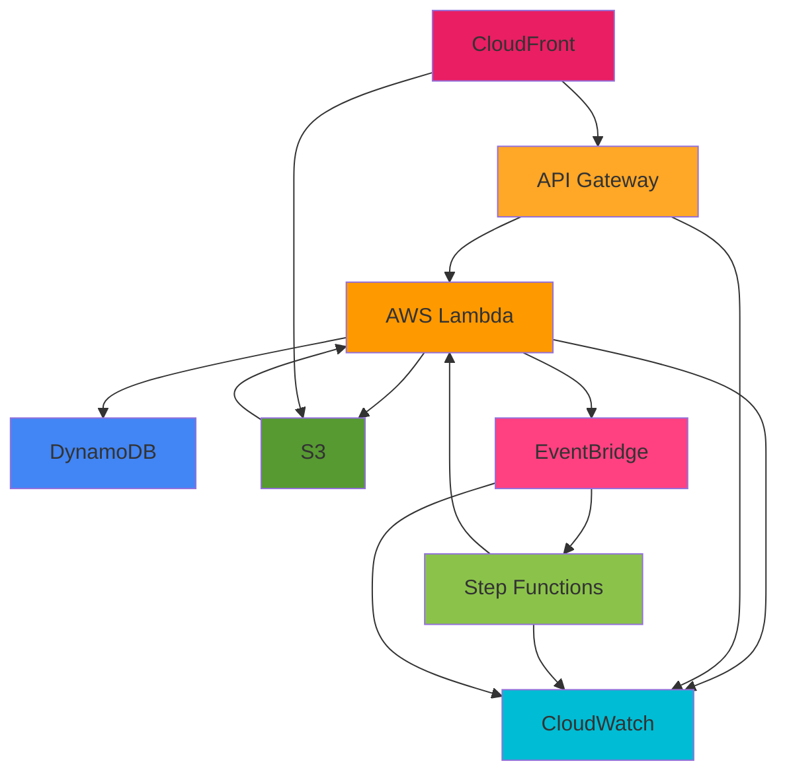

# AWS Services Reference

Complete reference of all AWS services used in the KYC platform, their configurations, and integration points.

## Table of Contents
- [Service Overview](#service-overview)
- [Compute Services](#compute-services)
- [Storage Services](#storage-services)
- [Database Services](#database-services)
- [Integration Services](#integration-services)
- [Networking & Content Delivery](#networking--content-delivery)
- [Management & Governance](#management--governance)
- [Service Limits](#service-limits)

## Service Overview

### Services Used

| Service | Purpose | Tier | Monthly Cost (Estimate) |
|---------|---------|------|-------------------------|
| AWS Lambda | Compute for agents | Free Tier | $0 (1M requests free) |
| API Gateway | REST API | Free Tier (12mo) | $0 (1M requests free) |
| DynamoDB | Database | Free Tier | $0 (25GB + 25 RCU/WCU free) |
| S3 | Storage | Free Tier | $0.50 (20GB) |
| CloudFront | CDN | Free Tier (12mo) | $0 (1TB transfer free) |
| EventBridge | Event bus | Always Free | $0 (14M events free) |
| Step Functions | Workflow | Pay-as-you-go | $1.00 (4000 transitions) |
| CloudWatch | Monitoring | Free Tier | $0 (10 metrics, 5GB logs) |
| **Total** | | | **~$1.50/month** |

### Service Regions

Default deployment: `us-east-1` (N. Virginia)

Supported regions: All regions supporting Step Functions

### Service Dependencies



## Compute Services

### AWS Lambda

#### Functions

##### 1. DocumentValidationAgent

```yaml
Function Name: DocumentValidationAgent
Runtime: Java 21 (Corretto)
Handler: com.kyc.agents.DocumentValidationAgent::handleRequest
Memory: 512 MB
Timeout: 30 seconds
Ephemeral Storage: 512 MB (default)
Architecture: x86_64

Environment Variables:
  TABLE_NAME: KYCRecords
  EVENT_BUS_NAME: kyc-event-bus
  DOCUMENT_BUCKET: kyc-documents-{account}-{region}

Triggers:
  - S3: ObjectCreated on kyc-documents-{account}-{region}/uploads/*

Permissions:
  - s3:GetObject (documents bucket)
  - dynamodb:PutItem (KYCRecords table)
  - events:PutEvents (event bus)
  - logs:CreateLogGroup, logs:CreateLogStream, logs:PutLogEvents

Log Group: /aws/lambda/DocumentValidationAgent
Log Retention: 7 days
```

##### 2. IdentityVerificationAgent

```yaml
Function Name: IdentityVerificationAgent
Runtime: Java 21 (Corretto)
Handler: com.kyc.agents.IdentityVerificationAgent::handleRequest
Memory: 512 MB
Timeout: 30 seconds

Environment Variables:
  TABLE_NAME: KYCRecords
  EVENT_BUS_NAME: kyc-event-bus
  DOCUMENT_BUCKET: kyc-documents-{account}-{region}

Triggers:
  - Step Functions: Invoked by KycWorkflow

Permissions:
  - s3:GetObject (documents bucket)
  - dynamodb:PutItem (KYCRecords table)
  - events:PutEvents (event bus)
  - logs:CreateLogGroup, logs:CreateLogStream, logs:PutLogEvents

Log Group: /aws/lambda/IdentityVerificationAgent
Log Retention: 7 days
```

##### 3. FraudDetectionAgent

```yaml
Function Name: FraudDetectionAgent
Runtime: Java 21 (Corretto)
Handler: com.kyc.agents.FraudDetectionAgent::handleRequest
Memory: 512 MB
Timeout: 30 seconds

Environment Variables:
  TABLE_NAME: KYCRecords
  EVENT_BUS_NAME: kyc-event-bus
  DOCUMENT_BUCKET: kyc-documents-{account}-{region}

Triggers:
  - Step Functions: Invoked by KycWorkflow

Permissions:
  - s3:GetObject (documents bucket)
  - dynamodb:PutItem (KYCRecords table)
  - events:PutEvents (event bus)
  - logs:CreateLogGroup, logs:CreateLogStream, logs:PutLogEvents

Log Group: /aws/lambda/FraudDetectionAgent
Log Retention: 7 days
```

##### 4. ComplianceReportingAgent

```yaml
Function Name: ComplianceReportingAgent
Runtime: Java 21 (Corretto)
Handler: com.kyc.agents.ComplianceReportingAgent::handleRequest
Memory: 512 MB
Timeout: 30 seconds

Environment Variables:
  TABLE_NAME: KYCRecords
  EVENT_BUS_NAME: kyc-event-bus
  DOCUMENT_BUCKET: kyc-documents-{account}-{region}

Triggers:
  - Step Functions: Invoked by KycWorkflow

Permissions:
  - s3:GetObject, s3:PutObject (documents bucket)
  - dynamodb:PutItem (KYCRecords table)
  - events:PutEvents (event bus)
  - logs:CreateLogGroup, logs:CreateLogStream, logs:PutLogEvents

Log Group: /aws/lambda/ComplianceReportingAgent
Log Retention: 7 days
```

##### 5. ApiHandler

```yaml
Function Name: KycStack-ApiHandler{random}
Runtime: Node.js 18.x
Handler: index.handler
Memory: 512 MB (default)
Timeout: 10 seconds

Environment Variables:
  TABLE_NAME: KYCRecords
  DOCUMENT_BUCKET: kyc-documents-{account}-{region}

Triggers:
  - API Gateway: All API endpoints

Permissions:
  - dynamodb:Query, dynamodb:Scan (KYCRecords table)
  - s3:PutObject (documents bucket - presigned URLs)
  - logs:CreateLogGroup, logs:CreateLogStream, logs:PutLogEvents

Log Group: /aws/lambda/KycStack-ApiHandler{random}
Log Retention: 7 days
```

#### Lambda Configuration Best Practices

```yaml
Concurrency:
  Reserved: Not set (uses account limit)
  Provisioned: Not configured (to save costs)

Code Deployment:
  Package Type: Zip
  Code Size: ~15 MB (Java agents with dependencies)

Monitoring:
  X-Ray Tracing: Not enabled (optional)
  Enhanced Monitoring: Via CloudWatch Logs

VPC Configuration:
  VPC: Not configured (public Lambda)
  Note: Can be added for enhanced security
```

## Storage Services

### Amazon S3

#### Buckets

##### 1. Documents Bucket

```yaml
Bucket Name: kyc-documents-{account}-{region}
Region: us-east-1 (or your deployment region)

Purpose: Store customer documents and compliance reports

Encryption:
  Type: Server-Side Encryption (SSE-S3)
  Algorithm: AES-256

Versioning: Enabled

Lifecycle Rules:
  - Transition to Intelligent Tiering: 30 days
  - Expiration: 90 days

CORS Configuration:
  Allowed Methods: GET, PUT, POST, DELETE, HEAD
  Allowed Origins: * (all origins)
  Allowed Headers: *
  Exposed Headers: ETag, x-amz-server-side-encryption, x-amz-request-id, x-amz-id-2
  Max Age: 3000 seconds

Public Access:
  Block All Public Access: Yes

Event Notifications:
  - Event: s3:ObjectCreated:*
    Filter: uploads/*
    Destination: DocumentValidationAgent Lambda

Folder Structure:
  /uploads/{customerId}/{timestamp}-{documentType}
  /reports/{customerId}/compliance-report-{timestamp}.txt

Cost:
  Storage: ~$0.023/GB/month
  Requests: ~$0.0004/1000 PUT requests
```

##### 2. UI Bucket

```yaml
Bucket Name: kyc-ui-{account}-{region}
Region: us-east-1 (or your deployment region)

Purpose: Host React application static files

Encryption:
  Type: Server-Side Encryption (SSE-S3)
  Algorithm: AES-256

Versioning: Not enabled

Static Website Hosting: Not directly (via CloudFront)

Public Access:
  Block All Public Access: Yes
  Access: Via CloudFront Origin Access Identity (OAI)

Contents:
  - index.html
  - assets/
    - JavaScript bundles
    - CSS files
    - Images and fonts

Cost:
  Storage: ~$0.023/GB/month (~0.5GB)
  Requests: Minimal (cached by CloudFront)
```

## Database Services

### Amazon DynamoDB

#### KYCRecords Table

```yaml
Table Name: KYCRecords
Region: us-east-1 (or your deployment region)

Primary Key:
  Partition Key: customerId (String)
  Sort Key: eventType (String)

Attributes:
  - customerId: String (PK)
  - eventType: String (SK)
  - kycStatus: String (enum)
  - documentUrl: String
  - verificationScore: Number
  - fraudScore: Number
  - lastUpdated: String (ISO 8601)
  - metadata: String

Global Secondary Indexes:
  1. KycStatusIndex
     Partition Key: kycStatus (String)
     Sort Key: lastUpdated (String)
     Projection: ALL

Billing Mode: PAY_PER_REQUEST (On-Demand)
  - No capacity planning needed
  - Scales automatically
  - Cost: $1.25 per million write requests
  - Cost: $0.25 per million read requests

Encryption:
  Type: AWS Managed (AWS owned CMK)
  At Rest: Yes

Point-in-Time Recovery (PITR): Enabled
  Retention: 35 days

Stream:
  Type: NEW_AND_OLD_IMAGES
  Status: Enabled (for future use)

TTL: Not configured

Tags:
  Application: KYC Platform
  Environment: Production
  ManagedBy: AWS CDK

Example Item:
{
  "customerId": "customer-001",
  "eventType": "Document.Validated",
  "kycStatus": "VALIDATED",
  "documentUrl": "s3://kyc-documents-123/uploads/customer-001/1234567890-passport",
  "verificationScore": 0.85,
  "lastUpdated": "2025-11-11T10:30:00Z",
  "metadata": "Document validated with score: 0.85"
}

Query Patterns:
  1. Get all events for a customer:
     PK = customerId
  
  2. Get specific event for a customer:
     PK = customerId AND SK = eventType
  
  3. Get all records by status:
     GSI: KycStatusIndex WHERE kycStatus = "COMPLETED"

Cost (Estimated):
  Storage: Free (within 25GB free tier)
  Reads: Free (within 25 RCU free tier)
  Writes: Free (within 25 WCU free tier)
```

## Integration Services

### Amazon EventBridge

```yaml
Event Bus Name: kyc-event-bus
Type: Custom Event Bus

Event Sources:
  - Lambda: DocumentValidationAgent
  - Lambda: IdentityVerificationAgent
  - Lambda: FraudDetectionAgent
  - Lambda: ComplianceReportingAgent

Event Patterns:
  Document.Validated:
    Source: kyc.validation
    DetailType: Document.Validated
    
  Identity.Verified:
    Source: kyc.verification
    DetailType: Identity.Verified
    
  Fraud.Checked:
    Source: kyc.fraud
    DetailType: Fraud.Checked
    
  KYC.Completed:
    Source: kyc.compliance
    DetailType: KYC.Completed

Rules:
  1. DocumentValidatedRule
     Event Pattern:
       source: [kyc.validation]
       detail-type: [Document.Validated]
     Target: Step Functions (KycWorkflow)

Archive: Not configured (can be added for compliance)

Schema Registry: Not configured (can be added for type safety)

Cost:
  Custom Events: Free (14M events/month)
  Event Replay: $0.10 per GB (if configured)
```

### AWS Step Functions

```yaml
State Machine Name: KycWorkflow
Type: Standard (not Express)

Definition: See kyc-workflow.asl.json

States:
  1. DocumentValidation (Task)
  2. CheckValidation (Choice)
  3. IdentityVerification (Task)
  4. CheckVerification (Choice)
  5. FraudDetection (Task)
  6. CheckFraud (Choice)
  7. ComplianceReporting (Task)
  8. KYCCompleted (Succeed)
  9. ValidationFailed (Fail)
  10. VerificationFailed (Fail)
  11. FraudDetected (Fail)
  12. FraudCheckFailed (Fail)
  13. ComplianceFailed (Fail)

Logging:
  Level: ALL
  Include Execution Data: Yes
  Destination: CloudWatch Logs (/aws/states/KycWorkflow)

Tracing:
  X-Ray: Enabled

Retry Configuration:
  Max Attempts: 3
  Interval: 2 seconds
  Backoff Rate: 2.0
  Errors: Lambda.ServiceException, Lambda.AWSLambdaException, Lambda.SdkClientException

Timeout: 5 minutes

Cost:
  State Transitions: $0.025 per 1000 transitions
  Estimated: ~$1/month (4000 transitions)
```

## Networking & Content Delivery

### Amazon API Gateway

```yaml
API Name: KYC Service API
Type: REST API
Protocol: HTTPS

Stage: prod

Endpoints:
  Base URL: https://{api-id}.execute-api.{region}.amazonaws.com/prod

  1. POST /upload
     Integration: Lambda (ApiHandler)
     Request: {"customerId": "string", "documentType": "string"}
     Response: {"uploadUrl": "string", "key": "string"}
     
  2. GET /kyc
     Integration: Lambda (ApiHandler)
     Response: KYCEvent[]
     
  3. GET /kyc/{customerId}
     Integration: Lambda (ApiHandler)
     Path Parameter: customerId
     Response: KYCEvent[]

CORS Configuration:
  Allowed Origins: *
  Allowed Methods: GET, POST, PUT, DELETE, OPTIONS
  Allowed Headers: Content-Type, X-Api-Key, Authorization
  Credentials: false

Throttling:
  Burst Limit: 5000 requests
  Rate Limit: 10000 requests/second

Logging:
  Access Logs: Enabled
  Execution Logs: INFO level
  Destination: CloudWatch Logs

Metrics:
  CloudWatch: Enabled
  Detailed: Yes

Authentication:
  Type: None (can add API Key or Cognito)

Cost:
  Requests: Free tier 1M/month (12 months)
  After: $3.50 per million requests
```

### Amazon CloudFront

```yaml
Distribution ID: {generated}
Origin: S3 (kyc-ui-{account}-{region})

Default Behavior:
  Viewer Protocol Policy: Redirect HTTP to HTTPS
  Allowed HTTP Methods: GET, HEAD, OPTIONS
  Cached HTTP Methods: GET, HEAD
  Cache Policy: CachingOptimized
  Compress Objects: Yes

Origins:
  1. S3 Origin (UI Bucket)
     Origin Access Identity: Enabled
     Custom Headers: None

Default Root Object: index.html

Error Pages:
  - Error Code: 404
    Response Code: 200
    Response Page: /index.html
    TTL: 300 seconds
    (For SPA routing support)

SSL/TLS:
  Certificate: CloudFront default (*.cloudfront.net)
  Minimum TLS Version: TLSv1.2_2021
  Security Policy: TLSv1.2_2021

Price Class: Use All Edge Locations

Distribution Status: Enabled

Cost:
  Data Transfer: Free tier 1TB/month (12 months)
  After: $0.085 per GB
  Requests: $0.01 per 10,000 requests
```

## Management & Governance

### AWS CloudWatch

#### Logs

```yaml
Log Groups:
  1. /aws/lambda/DocumentValidationAgent
  2. /aws/lambda/IdentityVerificationAgent
  3. /aws/lambda/FraudDetectionAgent
  4. /aws/lambda/ComplianceReportingAgent
  5. /aws/lambda/KycStack-ApiHandler{random}
  6. /aws/states/KycWorkflow
  7. /aws/apigateway/KYC Service API

Retention: 7 days (configurable)

Log Insights Queries: Not pre-configured

Cost:
  Ingestion: $0.50 per GB
  Storage: $0.03 per GB/month
  Estimated: ~$0 (within 5GB free tier)
```

#### Metrics

```yaml
Namespaces:
  - AWS/Lambda
  - AWS/ApiGateway
  - AWS/DynamoDB
  - AWS/S3
  - AWS/States
  - AWS/CloudFront

Custom Metrics: None configured

Default Metrics (Examples):
  Lambda:
    - Invocations
    - Errors
    - Duration
    - Throttles
    - ConcurrentExecutions
    
  API Gateway:
    - Count (requests)
    - Latency
    - 4XXError
    - 5XXError
    
  DynamoDB:
    - ConsumedReadCapacityUnits
    - ConsumedWriteCapacityUnits
    - UserErrors
    
  Step Functions:
    - ExecutionsStarted
    - ExecutionsSucceeded
    - ExecutionsFailed
    - ExecutionTime

Cost:
  First 10 Metrics: Free
  Additional: $0.30 per metric/month
```

#### Alarms (Optional - Not Configured by Default)

```yaml
Recommended Alarms:

1. Lambda Error Rate
   Metric: AWS/Lambda Errors
   Threshold: > 5% of invocations
   Period: 5 minutes
   Action: SNS notification

2. API Gateway 5XX Errors
   Metric: AWS/ApiGateway 5XXError
   Threshold: > 10 errors
   Period: 5 minutes
   Action: SNS notification

3. Step Functions Failed Executions
   Metric: AWS/States ExecutionsFailed
   Threshold: > 1 failure
   Period: 5 minutes
   Action: SNS notification

4. DynamoDB Throttled Requests
   Metric: AWS/DynamoDB UserErrors
   Threshold: > 5 errors
   Period: 5 minutes
   Action: SNS notification
```

## Service Limits

### AWS Lambda

```yaml
Concurrent Executions: 1000 (account-level, can request increase)
Function Timeout: 30 seconds (configured, max 900 seconds)
Memory: 512 MB (configured, max 10,240 MB)
Deployment Package Size: 50 MB (zipped), 250 MB (unzipped)
Environment Variables: 4 KB total
/tmp Storage: 512 MB (default, max 10,240 MB)
```

### API Gateway

```yaml
Throttle Burst: 5000 requests
Throttle Rate: 10000 requests/second
Integration Timeout: 29 seconds (max)
Payload Size: 10 MB (max)
```

### DynamoDB

```yaml
Item Size: 400 KB (max)
Partition Key: 2048 bytes (max)
Sort Key: 1024 bytes (max)
GSI per Table: 20 (max)
Read Capacity: Unlimited (on-demand)
Write Capacity: Unlimited (on-demand)
```

### S3

```yaml
Bucket Name Length: 3-63 characters
Object Size: 5 TB (max)
Multipart Upload Parts: 10,000 (max)
Request Rate: 3500 PUT/POST/DELETE, 5500 GET/HEAD per prefix/second
```

### Step Functions

```yaml
Execution History: 25,000 events
Execution Time: 1 year (max)
Execution ARN Length: 256 characters
Input/Output Size: 256 KB
```

## Service Integration Matrix

| From ↓ To → | Lambda | S3 | DynamoDB | EventBridge | Step Functions | API Gateway | CloudFront |
|-------------|--------|-----|----------|-------------|----------------|-------------|------------|
| **Lambda** | ❌ | ✅ | ✅ | ✅ | ❌ | ❌ | ❌ |
| **S3** | ✅ | ❌ | ❌ | ✅ | ❌ | ❌ | ❌ |
| **EventBridge** | ✅ | ❌ | ❌ | ❌ | ✅ | ❌ | ❌ |
| **Step Functions** | ✅ | ❌ | ✅ | ✅ | ❌ | ❌ | ❌ |
| **API Gateway** | ✅ | ❌ | ❌ | ❌ | ❌ | ❌ | ❌ |
| **CloudFront** | ❌ | ✅ | ❌ | ❌ | ❌ | ✅ | ❌ |

✅ = Integrated in this architecture  
❌ = Not integrated

## Next Steps

- [Infrastructure Guide](./04-infrastructure.md) - CDK implementation details
- [Deployment Guide](./05-deployment.md) - Deploy these services
- [Monitoring Guide](./12-monitoring.md) - Set up monitoring and alarms
- [Cost Analysis](./17-cost-analysis.md) - Detailed cost breakdown
