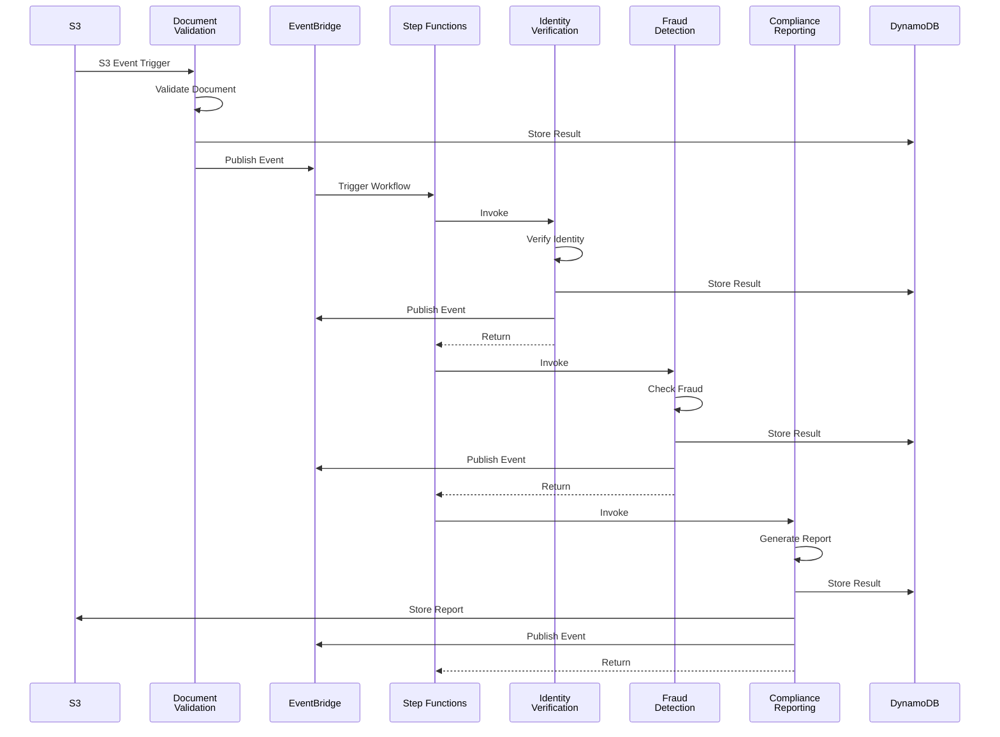

# Backend Services Documentation

Complete reference for all Java Lambda agents in the KYC platform.

## Table of Contents
- [Overview](#overview)
- [Agent Architecture](#agent-architecture)
- [Document Validation Agent](#document-validation-agent)
- [Identity Verification Agent](#identity-verification-agent)
- [Fraud Detection Agent](#fraud-detection-agent)
- [Compliance Reporting Agent](#compliance-reporting-agent)
- [Data Models](#data-models)
- [Development Guide](#development-guide)

## Overview

The KYC platform uses **four specialized Lambda agents** built with Java 21. Each agent is responsible for a specific part of the KYC verification workflow.

### Technology Stack

```yaml
Language: Java 21
Framework: AWS Lambda Java SDK
Build Tool: Maven 3.x
Runtime: AWS Lambda Java 21 (Corretto)
Package Size: ~15 MB (with dependencies)

Key Dependencies:
  - aws-lambda-java-core: 1.2.3
  - aws-lambda-java-events: 3.11.3
  - AWS SDK v2: 2.20.0
    - DynamoDB
    - EventBridge
    - S3
  - Jackson: 2.15.2 (JSON processing)
  - SLF4J: 2.0.9 (Logging)
```

### Agent Communication Flow



## Agent Architecture

### Common Patterns

All agents follow these patterns:

1. **RequestHandler Interface**: Implement `RequestHandler<InputType, OutputType>`
2. **AWS SDK Clients**: Initialize in constructor for reuse across invocations
3. **Environment Variables**: Configuration via environment variables
4. **Structured Logging**: Use SLF4J for consistent logging
5. **Event Publishing**: Publish events to EventBridge
6. **DynamoDB Storage**: Store results for auditability
7. **Error Handling**: Graceful error handling with retries

### Base Agent Structure

```java
public class BaseAgent implements RequestHandler<InputType, KYCEvent> {
    private static final Logger logger = LoggerFactory.getLogger(BaseAgent.class);
    private final DynamoDbClient dynamoDbClient;
    private final EventBridgeClient eventBridgeClient;
    private final String tableName;
    private final String eventBusName;
    
    public BaseAgent() {
        // Initialize AWS SDK clients (reused across invocations)
        this.dynamoDbClient = DynamoDbClient.create();
        this.eventBridgeClient = EventBridgeClient.create();
        this.tableName = System.getenv("TABLE_NAME");
        this.eventBusName = System.getenv("EVENT_BUS_NAME");
    }
    
    @Override
    public KYCEvent handleRequest(InputType input, Context context) {
        // 1. Extract input data
        // 2. Perform agent-specific logic
        // 3. Store result in DynamoDB
        // 4. Publish event to EventBridge
        // 5. Return KYCEvent
    }
    
    private void storeToDynamoDB(KYCEvent event) { /* ... */ }
    private void publishEvent(KYCEvent event) { /* ... */ }
}
```

## Document Validation Agent

### Purpose

First agent in the KYC workflow. Validates uploaded documents for format, size, and quality.

### Configuration

```yaml
Function Name: DocumentValidationAgent
Handler: com.kyc.agents.DocumentValidationAgent::handleRequest
Runtime: Java 21
Memory: 512 MB
Timeout: 30 seconds

Environment Variables:
  TABLE_NAME: KYCRecords
  EVENT_BUS_NAME: kyc-event-bus
  DOCUMENT_BUCKET: kyc-documents-{account}-{region}

Trigger:
  Type: S3 Event
  Bucket: kyc-documents-{account}-{region}
  Events: s3:ObjectCreated:*
  Prefix: uploads/

IAM Permissions:
  - s3:GetObject
  - dynamodb:PutItem
  - events:PutEvents
  - logs:*
```

### Input

S3Event from AWS Lambda Java Events library:

```java
S3Event {
  Records: [
    {
      s3: {
        bucket: { name: "kyc-documents-123-us-east-1" },
        object: { key: "uploads/customer-001/1234567890-passport" }
      }
    }
  ]
}
```

### Processing Logic

```java
@Override
public KYCEvent handleRequest(S3Event s3Event, Context context) {
    // 1. Extract S3 object details
    String bucket = record.getS3().getBucket().getName();
    String key = record.getS3().getObject().getKey();
    String customerId = extractCustomerIdFromKey(key); // uploads/{customerId}/{filename}
    
    // 2. Validate document
    boolean isValid = validateDocument(documentUrl);
    //   - Check file format (PDF, JPEG, PNG)
    //   - Verify file size (< 10 MB)
    //   - Check document quality
    //   - Extract metadata
    
    // 3. Calculate validation score (0.0 - 1.0)
    double validationScore = calculateValidationScore(documentUrl);
    
    // 4. Create KYC event
    KYCEvent event = KYCEvent.builder()
        .customerId(customerId)
        .eventType("Document.Validated")
        .kycStatus(isValid ? KYCStatus.VALIDATED : KYCStatus.FAILED)
        .documentUrl(documentUrl)
        .verificationScore(validationScore)
        .isValid(isValid)
        .lastUpdated(Instant.now().toString())
        .build();
    
    // 5. Store in DynamoDB
    storeToDynamoDB(event);
    
    // 6. Publish event (if valid)
    if (isValid) {
        publishEvent(event);
    }
    
    return event;
}
```

### Validation Checks

| Check | Description | Failure Action |
|-------|-------------|----------------|
| File Format | Validate extension (pdf, jpg, png) | Mark as FAILED |
| File Size | Check size < 10 MB | Mark as FAILED |
| File Integrity | Verify file is not corrupted | Mark as FAILED |
| Metadata | Extract document metadata | Log warning if missing |

### Output

```java
KYCEvent {
  customerId: "customer-001",
  eventType: "Document.Validated",
  kycStatus: "VALIDATED",
  documentUrl: "s3://bucket/uploads/customer-001/1234567890-passport",
  verificationScore: 0.85,
  isValid: true,
  lastUpdated: "2025-11-11T10:30:00Z",
  metadata: "Document validated with score: 0.85"
}
```

### EventBridge Event

```json
{
  "Source": "kyc.validation",
  "DetailType": "Document.Validated",
  "Detail": {
    "customerId": "customer-001",
    "eventType": "Document.Validated",
    "kycStatus": "VALIDATED",
    "documentUrl": "s3://bucket/uploads/customer-001/1234567890-passport",
    "verificationScore": 0.85,
    "isValid": true,
    "lastUpdated": "2025-11-11T10:30:00Z"
  }
}
```

## Identity Verification Agent

### Purpose

Verifies customer identity by extracting and validating document information.

### Configuration

```yaml
Function Name: IdentityVerificationAgent
Handler: com.kyc.agents.IdentityVerificationAgent::handleRequest
Runtime: Java 21
Memory: 512 MB
Timeout: 30 seconds

Environment Variables:
  TABLE_NAME: KYCRecords
  EVENT_BUS_NAME: kyc-event-bus
  DOCUMENT_BUCKET: kyc-documents-{account}-{region}

Trigger:
  Type: Step Functions
  Invoked by: KycWorkflow state machine

IAM Permissions:
  - s3:GetObject
  - dynamodb:PutItem
  - events:PutEvents
  - logs:*
```

### Input

Map from Step Functions containing previous validation result:

```java
{
  "validationResult": {
    "Payload": {
      "customerId": "customer-001",
      "documentUrl": "s3://...",
      "isValid": true,
      "verificationScore": 0.85
    }
  }
}
```

### Processing Logic

```java
@Override
public KYCEvent handleRequest(Map<String, Object> input, Context context) {
    // 1. Extract validation result
    Map<String, Object> validationResult = extractValidationResult(input);
    String customerId = (String) validationResult.get("customerId");
    String documentUrl = (String) validationResult.get("documentUrl");
    
    // 2. Verify identity
    boolean isVerified = verifyIdentity(customerId, documentUrl);
    //   - Extract document data (OCR in production)
    //   - Cross-reference with databases
    //   - Validate personal information
    //   - Check document authenticity
    //   - Perform liveness detection (if applicable)
    
    // 3. Calculate verification score
    double verificationScore = calculateVerificationScore(customerId);
    
    // 4. Create KYC event
    KYCEvent event = KYCEvent.builder()
        .customerId(customerId)
        .eventType("Identity.Verified")
        .kycStatus(isVerified ? KYCStatus.VERIFIED : KYCStatus.FAILED)
        .documentUrl(documentUrl)
        .verificationScore(verificationScore)
        .isVerified(isVerified)
        .lastUpdated(Instant.now().toString())
        .build();
    
    // 5. Store and publish
    storeToDynamoDB(event);
    if (isVerified) {
        publishEvent(event);
    }
    
    return event;
}
```

### Verification Checks

| Check | Description | Score Weight |
|-------|-------------|--------------|
| Document Data Extraction | OCR and data parsing | 30% |
| Database Cross-Reference | Verify against external DBs | 25% |
| Personal Info Validation | Check name, DOB, address | 20% |
| Document Authenticity | Security features, watermarks | 15% |
| Liveness Detection | Facial recognition (if photo) | 10% |

### Output

```java
KYCEvent {
  customerId: "customer-001",
  eventType: "Identity.Verified",
  kycStatus: "VERIFIED",
  documentUrl: "s3://...",
  verificationScore: 0.92,
  isVerified: true,
  lastUpdated: "2025-11-11T10:31:00Z",
  metadata: "Identity verified with score: 0.92"
}
```

## Fraud Detection Agent

### Purpose

Analyzes documents and customer data for fraud indicators and suspicious patterns.

### Configuration

```yaml
Function Name: FraudDetectionAgent
Handler: com.kyc.agents.FraudDetectionAgent::handleRequest
Runtime: Java 21
Memory: 512 MB
Timeout: 30 seconds

Environment Variables:
  TABLE_NAME: KYCRecords
  EVENT_BUS_NAME: kyc-event-bus
  DOCUMENT_BUCKET: kyc-documents-{account}-{region}

Trigger:
  Type: Step Functions
  Invoked by: KycWorkflow state machine

IAM Permissions:
  - s3:GetObject
  - dynamodb:PutItem
  - events:PutEvents
  - logs:*
```

### Input

Map from Step Functions containing previous verification result:

```java
{
  "verificationResult": {
    "Payload": {
      "customerId": "customer-001",
      "documentUrl": "s3://...",
      "isVerified": true,
      "verificationScore": 0.92
    }
  }
}
```

### Processing Logic

```java
@Override
public KYCEvent handleRequest(Map<String, Object> input, Context context) {
    // 1. Extract verification result
    Map<String, Object> verificationResult = extractVerificationResult(input);
    String customerId = (String) verificationResult.get("customerId");
    String documentUrl = (String) verificationResult.get("documentUrl");
    
    // 2. Detect fraud
    boolean fraudDetected = detectFraud(customerId, documentUrl);
    //   - Analyze document for tampering
    //   - Check fraud databases
    //   - Detect anomalous patterns
    //   - Verify document security features
    //   - Check IP/location consistency
    //   - Behavioral analysis
    
    // 3. Calculate fraud/risk score (0.0 = no risk, 1.0 = high risk)
    double fraudScore = calculateFraudScore(customerId);
    
    // 4. Create KYC event
    KYCEvent event = KYCEvent.builder()
        .customerId(customerId)
        .eventType("Fraud.Checked")
        .kycStatus(fraudDetected ? KYCStatus.FRAUD_DETECTED : KYCStatus.VERIFIED)
        .documentUrl(documentUrl)
        .fraudScore(fraudScore)
        .fraudDetected(fraudDetected)
        .lastUpdated(Instant.now().toString())
        .build();
    
    // 5. Store and publish
    storeToDynamoDB(event);
    publishEvent(event);
    
    return event;
}
```

### Fraud Indicators

| Indicator | Risk Level | Action |
|-----------|------------|--------|
| Document Tampering | High | Mark as FRAUD_DETECTED |
| Blacklist Match | High | Mark as FRAUD_DETECTED |
| Suspicious Patterns | Medium | Increase fraud score |
| Missing Security Features | Medium | Increase fraud score |
| Geographic Anomalies | Low | Log for review |
| Behavioral Red Flags | Low | Log for review |

### Output

```java
KYCEvent {
  customerId: "customer-001",
  eventType: "Fraud.Checked",
  kycStatus: "VERIFIED", // or "FRAUD_DETECTED"
  documentUrl: "s3://...",
  fraudScore: 0.15, // Low risk
  fraudDetected: false,
  lastUpdated: "2025-11-11T10:32:00Z",
  metadata: "Fraud check completed - Risk score: 0.15"
}
```

## Compliance Reporting Agent

### Purpose

Final agent that aggregates all verification results and generates comprehensive compliance reports.

### Configuration

```yaml
Function Name: ComplianceReportingAgent
Handler: com.kyc.agents.ComplianceReportingAgent::handleRequest
Runtime: Java 21
Memory: 512 MB
Timeout: 30 seconds

Environment Variables:
  TABLE_NAME: KYCRecords
  EVENT_BUS_NAME: kyc-event-bus
  DOCUMENT_BUCKET: kyc-documents-{account}-{region}

Trigger:
  Type: Step Functions
  Invoked by: KycWorkflow state machine

IAM Permissions:
  - s3:GetObject
  - s3:PutObject
  - dynamodb:PutItem
  - events:PutEvents
  - logs:*
```

### Input

Map from Step Functions containing all previous results:

```java
{
  "validationResult": { "Payload": { ... } },
  "verificationResult": { "Payload": { ... } },
  "fraudResult": { "Payload": { "fraudDetected": false, ... } }
}
```

### Processing Logic

```java
@Override
public KYCEvent handleRequest(Map<String, Object> input, Context context) {
    // 1. Extract fraud result
    Map<String, Object> fraudResult = extractFraudResult(input);
    String customerId = (String) fraudResult.get("customerId");
    Boolean fraudDetected = (Boolean) fraudResult.get("fraudDetected");
    
    // 2. Generate compliance report
    String reportContent = generateComplianceReport(input, customerId);
    //   - Aggregate all verification results
    //   - Document validation summary
    //   - Identity verification summary
    //   - Fraud detection summary
    //   - Final recommendation
    //   - Audit trail information
    
    // 3. Store report in S3
    String reportUrl = storeComplianceReport(customerId, reportContent);
    
    // 4. Determine final KYC status
    KYCStatus finalStatus = fraudDetected ? 
        KYCStatus.FRAUD_DETECTED : KYCStatus.COMPLETED;
    
    // 5. Create final KYC event
    KYCEvent event = KYCEvent.builder()
        .customerId(customerId)
        .eventType("Compliance.Completed")
        .kycStatus(finalStatus)
        .documentUrl(reportUrl)
        .lastUpdated(Instant.now().toString())
        .metadata("KYC process completed - Final status: " + finalStatus)
        .build();
    
    // 6. Store and publish
    storeToDynamoDB(event);
    publishEvent(event);
    
    return event;
}
```

### Compliance Report Format

```text
KYC COMPLIANCE REPORT
==================================================

Customer ID: customer-001
Report Date: 2025-11-11T10:33:00Z

1. DOCUMENT VALIDATION
--------------------------------------------------
Status: VALIDATED
Score: 0.85
Details: Document format validated successfully

2. IDENTITY VERIFICATION
--------------------------------------------------
Status: VERIFIED
Score: 0.92
Details: Identity verified through multiple checks

3. FRAUD DETECTION
--------------------------------------------------
Fraud Detected: false
Risk Score: 0.15
Details: No fraud indicators found

4. FINAL RECOMMENDATION
--------------------------------------------------
KYC Process: COMPLETED
Compliance Status: APPROVED
Overall Risk: LOW

==================================================
End of Report
```

### Output

```java
KYCEvent {
  customerId: "customer-001",
  eventType: "Compliance.Completed",
  kycStatus: "COMPLETED",
  documentUrl: "s3://.../reports/customer-001/compliance-report-1234567890.txt",
  lastUpdated: "2025-11-11T10:33:00Z",
  metadata: "KYC process completed - Final status: COMPLETED"
}
```

## Data Models

### KYCEvent Class

```java
package com.kyc.model;

public class KYCEvent {
    private String customerId;
    private String eventType;
    private KYCStatus kycStatus;
    private String documentUrl;
    private Double verificationScore;
    private Double fraudScore;
    private String metadata;
    private String lastUpdated;
    private Boolean isValid;
    private Boolean isVerified;
    private Boolean fraudDetected;
    
    public enum KYCStatus {
        PENDING,
        VALIDATED,
        VERIFIED,
        FRAUD_DETECTED,
        COMPLETED,
        FAILED
    }
    
    // Builder pattern for construction
    public static Builder builder() { return new Builder(); }
    
    // Getters, setters, builder implementation...
}
```

## Development Guide

### Local Development Setup

```bash
# Prerequisites
java -version  # Java 21+
mvn --version  # Maven 3.x+

# Clone and build
git clone https://github.com/your-org/kyc-serverless
cd kyc-serverless/backend
mvn clean package

# Run tests
mvn test

# Build for deployment
mvn clean package
```

### Testing Locally

```bash
# Install SAM CLI
brew install aws-sam-cli

# Invoke function locally
sam local invoke DocumentValidationAgent \
  -e events/s3-event-sample.json

# Start local API
sam local start-api
```

### Adding New Agent

1. Create new Java class extending RequestHandler
2. Implement business logic
3. Add to pom.xml if new dependencies needed
4. Update infrastructure/lib/kyc-stack.ts with new Lambda
5. Update Step Functions definition if needed
6. Deploy and test

### Best Practices

1. **Cold Start Optimization**
   - Initialize SDK clients in constructor
   - Use lazy initialization for heavy objects
   - Consider Lambda SnapStart for Java 11+

2. **Error Handling**
   - Catch and log all exceptions
   - Return meaningful error messages
   - Use Step Functions retry logic

3. **Logging**
   - Use structured logging (JSON)
   - Include correlation IDs
   - Log at appropriate levels

4. **Testing**
   - Unit tests for business logic
   - Integration tests with LocalStack
   - Load testing with Artillery

5. **Performance**
   - Optimize memory allocation
   - Use DynamoDB batch operations
   - Minimize S3 calls

### Debugging

```bash
# View logs in real-time
aws logs tail /aws/lambda/DocumentValidationAgent --follow

# Search for errors
aws logs filter-log-events \
  --log-group-name /aws/lambda/DocumentValidationAgent \
  --filter-pattern "ERROR"

# Get function metrics
aws cloudwatch get-metric-statistics \
  --namespace AWS/Lambda \
  --metric-name Duration \
  --dimensions Name=FunctionName,Value=DocumentValidationAgent \
  --start-time $(date -u -d '1 hour ago' +%Y-%m-%dT%H:%M:%S) \
  --end-time $(date -u +%Y-%m-%dT%H:%M:%S) \
  --period 300 \
  --statistics Average,Maximum
```

## Next Steps

- [API Reference](./09-api-reference.md) - API endpoint documentation
- [Data Models](./10-data-models.md) - Detailed data structures
- [Performance Tuning](./16-performance-tuning.md) - Optimization guide
- [Troubleshooting](./13-troubleshooting.md) - Common issues
