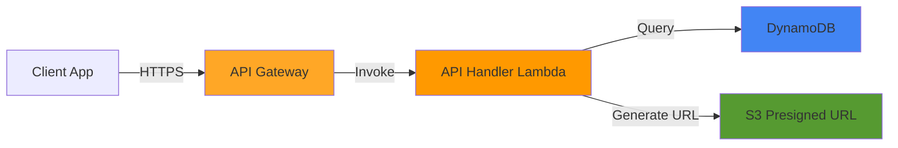
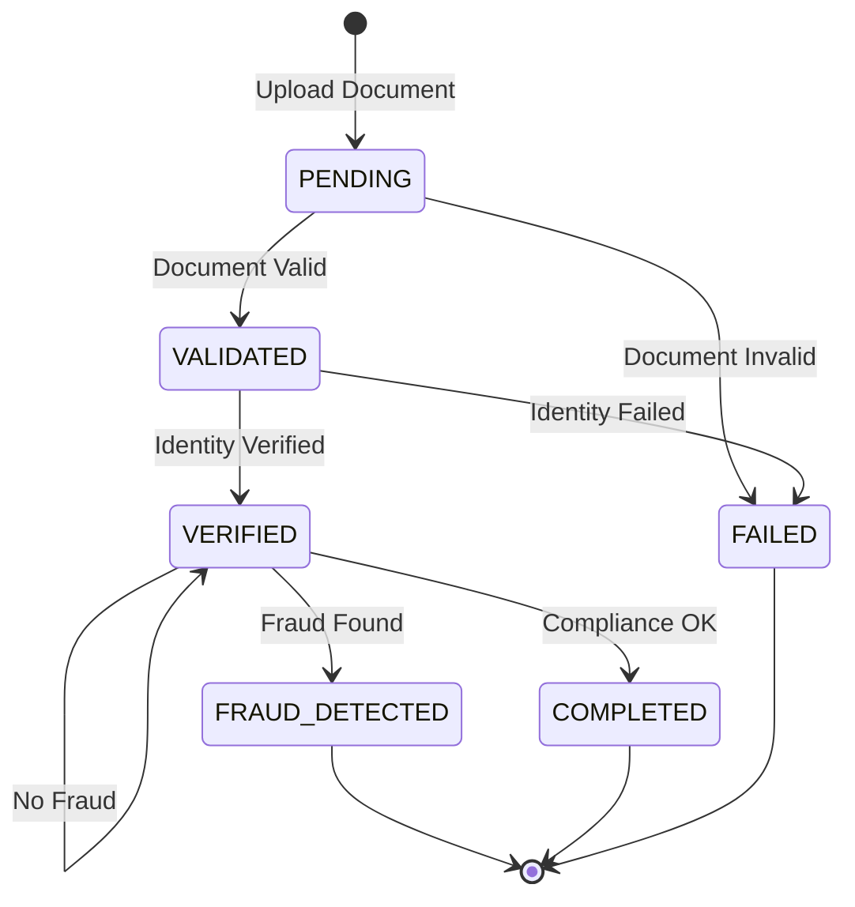

# API Reference

Complete API documentation for the KYC platform REST API.

## Table of Contents
- [Overview](#overview)
- [Authentication](#authentication)
- [Endpoints](#endpoints)
- [Request/Response Formats](#requestresponse-formats)
- [Error Handling](#error-handling)
- [Rate Limiting](#rate-limiting)
- [Examples](#examples)

## Overview

### Base URL

```
https://{api-id}.execute-api.{region}.amazonaws.com/prod
```

To find your API URL:
```bash
aws cloudformation describe-stacks --stack-name KycStack \
  --query "Stacks[0].Outputs[?OutputKey=='ApiUrl'].OutputValue" --output text
```

### API Design

- **Type**: REST API
- **Protocol**: HTTPS only
- **Format**: JSON
- **Version**: 1.0
- **CORS**: Enabled for all origins (configurable)

### API Architecture



## Authentication

### Current: None (Development)

In development mode, no authentication is required. All endpoints are publicly accessible.

### Production: API Key (Recommended)

```bash
# Add API key header
curl -H "x-api-key: YOUR_API_KEY" \
  https://api-url/kyc
```

### Production: Cognito (Enhanced Security)

```bash
# Get token from Cognito
TOKEN=$(aws cognito-idp initiate-auth ...)

# Use token in Authorization header
curl -H "Authorization: Bearer $TOKEN" \
  https://api-url/kyc
```

## Endpoints

### Overview

| Method | Endpoint | Description | Auth Required |
|--------|----------|-------------|---------------|
| POST | `/upload` | Generate presigned S3 upload URL | No* |
| GET | `/kyc` | List all KYC records | No* |
| GET | `/kyc/{customerId}` | Get records for specific customer | No* |

*Auth can be enabled in production

---

### POST /upload

Generate a presigned URL for direct S3 document upload.

#### Request

**Method**: `POST`  
**Path**: `/upload`  
**Content-Type**: `application/json`

**Body Parameters**:

| Parameter | Type | Required | Description |
|-----------|------|----------|-------------|
| `customerId` | string | Yes | Unique customer identifier |
| `documentType` | string | Yes | Type of document (passport, drivers-license, national-id, utility-bill, bank-statement) |

**Example Request**:
```bash
curl -X POST https://api-url/prod/upload \
  -H "Content-Type: application/json" \
  -d '{
    "customerId": "customer-001",
    "documentType": "passport"
  }'
```

**Request Body Example**:
```json
{
  "customerId": "customer-001",
  "documentType": "passport"
}
```

#### Response

**Status**: `200 OK`  
**Content-Type**: `application/json`

**Response Body**:

| Field | Type | Description |
|-------|------|-------------|
| `uploadUrl` | string | Presigned S3 URL for uploading the document |
| `key` | string | S3 object key where document will be stored |

**Example Response**:
```json
{
  "uploadUrl": "https://kyc-documents-123-us-east-1.s3.amazonaws.com/uploads/customer-001/1699701234567-passport?X-Amz-Algorithm=AWS4-HMAC-SHA256&X-Amz-Credential=...",
  "key": "uploads/customer-001/1699701234567-passport"
}
```

#### Usage

After receiving the presigned URL, upload the document directly to S3:

```bash
curl -X PUT "$UPLOAD_URL" \
  --upload-file ./document.pdf \
  -H "Content-Type: application/pdf"
```

#### Error Responses

**400 Bad Request** - Missing or invalid parameters:
```json
{
  "message": "customerId is required"
}
```

**500 Internal Server Error** - Server error:
```json
{
  "message": "Internal Server Error",
  "error": "Error details"
}
```

---

### GET /kyc

Retrieve all KYC records in the system.

#### Request

**Method**: `GET`  
**Path**: `/kyc`  
**Content-Type**: `application/json`

**Query Parameters**: None

**Example Request**:
```bash
curl -X GET https://api-url/prod/kyc \
  -H "Content-Type: application/json"
```

#### Response

**Status**: `200 OK`  
**Content-Type**: `application/json`

**Response Body**: Array of KYCEvent objects

**Example Response**:
```json
[
  {
    "customerId": "customer-001",
    "eventType": "Document.Validated",
    "kycStatus": "VALIDATED",
    "documentUrl": "s3://kyc-documents-123-us-east-1/uploads/customer-001/1699701234567-passport",
    "verificationScore": 0.85,
    "lastUpdated": "2025-11-11T10:30:00.000Z",
    "metadata": "Document validated with score: 0.85"
  },
  {
    "customerId": "customer-001",
    "eventType": "Identity.Verified",
    "kycStatus": "VERIFIED",
    "documentUrl": "s3://kyc-documents-123-us-east-1/uploads/customer-001/1699701234567-passport",
    "verificationScore": 0.92,
    "lastUpdated": "2025-11-11T10:31:00.000Z",
    "metadata": "Identity verified with score: 0.92"
  },
  {
    "customerId": "customer-002",
    "eventType": "Compliance.Completed",
    "kycStatus": "COMPLETED",
    "documentUrl": "s3://kyc-documents-123-us-east-1/reports/customer-002/compliance-report-1699701300000.txt",
    "lastUpdated": "2025-11-11T10:35:00.000Z",
    "metadata": "KYC process completed - Final status: COMPLETED"
  }
]
```

#### Pagination

Currently returns up to 100 most recent records. For production, implement pagination:

**Future Enhancement**:
```bash
GET /kyc?limit=20&lastKey=customer-001:Document.Validated
```

#### Filtering

For status-based filtering, use DynamoDB directly or implement query parameters:

**Future Enhancement**:
```bash
GET /kyc?status=COMPLETED
GET /kyc?startDate=2025-11-01&endDate=2025-11-30
```

---

### GET /kyc/{customerId}

Retrieve all KYC events for a specific customer.

#### Request

**Method**: `GET`  
**Path**: `/kyc/{customerId}`  
**Content-Type**: `application/json`

**Path Parameters**:

| Parameter | Type | Required | Description |
|-----------|------|----------|-------------|
| `customerId` | string | Yes | Customer identifier |

**Example Request**:
```bash
curl -X GET https://api-url/prod/kyc/customer-001 \
  -H "Content-Type: application/json"
```

#### Response

**Status**: `200 OK`  
**Content-Type**: `application/json`

**Response Body**: Array of KYCEvent objects for the specified customer

**Example Response**:
```json
[
  {
    "customerId": "customer-001",
    "eventType": "Document.Validated",
    "kycStatus": "VALIDATED",
    "documentUrl": "s3://kyc-documents-123-us-east-1/uploads/customer-001/1699701234567-passport",
    "verificationScore": 0.85,
    "lastUpdated": "2025-11-11T10:30:00.000Z",
    "metadata": "Document validated with score: 0.85"
  },
  {
    "customerId": "customer-001",
    "eventType": "Identity.Verified",
    "kycStatus": "VERIFIED",
    "documentUrl": "s3://kyc-documents-123-us-east-1/uploads/customer-001/1699701234567-passport",
    "verificationScore": 0.92,
    "lastUpdated": "2025-11-11T10:31:00.000Z",
    "metadata": "Identity verified with score: 0.92"
  },
  {
    "customerId": "customer-001",
    "eventType": "Fraud.Checked",
    "kycStatus": "VERIFIED",
    "documentUrl": "s3://kyc-documents-123-us-east-1/uploads/customer-001/1699701234567-passport",
    "fraudScore": 0.15,
    "lastUpdated": "2025-11-11T10:32:00.000Z",
    "metadata": "Fraud check completed - Risk score: 0.15"
  },
  {
    "customerId": "customer-001",
    "eventType": "Compliance.Completed",
    "kycStatus": "COMPLETED",
    "documentUrl": "s3://kyc-documents-123-us-east-1/reports/customer-001/compliance-report-1699701400000.txt",
    "lastUpdated": "2025-11-11T10:33:00.000Z",
    "metadata": "KYC process completed - Final status: COMPLETED"
  }
]
```

**Empty Response** (customer not found or no events):
```json
[]
```

---

## Request/Response Formats

### KYCEvent Object

The primary data structure used throughout the API.

```typescript
interface KYCEvent {
  customerId: string;           // Customer identifier
  eventType: string;            // Event type (see Event Types below)
  kycStatus: KYCStatus;         // Current KYC status
  documentUrl?: string;         // S3 URL of document or report
  verificationScore?: number;   // Verification score (0.0 - 1.0)
  fraudScore?: number;          // Fraud risk score (0.0 - 1.0)
  metadata?: string;            // Additional information
  lastUpdated: string;          // ISO 8601 timestamp
}

enum KYCStatus {
  PENDING = "PENDING",
  VALIDATED = "VALIDATED",
  VERIFIED = "VERIFIED",
  FRAUD_DETECTED = "FRAUD_DETECTED",
  COMPLETED = "COMPLETED",
  FAILED = "FAILED"
}
```

### Event Types

| Event Type | Description | Published By |
|------------|-------------|--------------|
| `Document.Validated` | Document validation complete | DocumentValidationAgent |
| `Identity.Verified` | Identity verification complete | IdentityVerificationAgent |
| `Fraud.Checked` | Fraud detection complete | FraudDetectionAgent |
| `Compliance.Completed` | Final compliance report generated | ComplianceReportingAgent |

### KYC Status Flow



### Document Types

| Type | Description | Format |
|------|-------------|--------|
| `passport` | Passport | PDF, JPG, PNG |
| `drivers-license` | Driver's License | PDF, JPG, PNG |
| `national-id` | National ID Card | PDF, JPG, PNG |
| `utility-bill` | Utility Bill (address proof) | PDF, JPG, PNG |
| `bank-statement` | Bank Statement | PDF |

## Error Handling

### Error Response Format

All error responses follow this structure:

```json
{
  "message": "Human-readable error message",
  "error": "Technical error details (optional)",
  "path": "/kyc/customer-001",
  "method": "GET"
}
```

### HTTP Status Codes

| Code | Meaning | When It Occurs |
|------|---------|----------------|
| 200 | OK | Successful request |
| 400 | Bad Request | Invalid input parameters |
| 404 | Not Found | Resource not found (future use) |
| 500 | Internal Server Error | Server-side error |
| 503 | Service Unavailable | Temporary outage |

### Common Errors

**Missing Parameter**:
```json
{
  "statusCode": 400,
  "message": "customerId is required"
}
```

**Internal Server Error**:
```json
{
  "statusCode": 500,
  "message": "Internal Server Error",
  "error": "DynamoDB query failed"
}
```

### Error Handling Best Practices

```javascript
// Client-side error handling example
async function getKycRecords(customerId) {
  try {
    const response = await fetch(`${API_URL}/kyc/${customerId}`);
    
    if (!response.ok) {
      const error = await response.json();
      throw new Error(error.message || 'Request failed');
    }
    
    return await response.json();
  } catch (error) {
    console.error('API Error:', error.message);
    // Handle error appropriately (retry, alert user, etc.)
    throw error;
  }
}
```

## Rate Limiting

### Current Limits

```yaml
API Gateway Throttling:
  Rate Limit: 10,000 requests/second
  Burst Limit: 5,000 requests

Per-Client Limits (if API key enabled):
  Rate Limit: 100 requests/second
  Burst Limit: 200 requests
  Quota: 10,000 requests/day
```

### Rate Limit Headers

When rate limiting is enabled, responses include:

```
X-RateLimit-Limit: 100
X-RateLimit-Remaining: 95
X-RateLimit-Reset: 1699701600
```

### Rate Limit Exceeded

**Status**: `429 Too Many Requests`

```json
{
  "message": "Rate limit exceeded. Retry after 60 seconds."
}
```

## Examples

### Complete Upload Flow

```bash
#!/bin/bash
# complete-upload-flow.sh

API_URL="https://your-api-id.execute-api.us-east-1.amazonaws.com/prod"
CUSTOMER_ID="customer-$(date +%s)"
DOCUMENT="./passport.pdf"

echo "1. Requesting upload URL..."
RESPONSE=$(curl -s -X POST $API_URL/upload \
  -H "Content-Type: application/json" \
  -d "{\"customerId\":\"$CUSTOMER_ID\",\"documentType\":\"passport\"}")

UPLOAD_URL=$(echo $RESPONSE | jq -r '.uploadUrl')
echo "Upload URL received"

echo "2. Uploading document..."
curl -X PUT "$UPLOAD_URL" \
  --upload-file $DOCUMENT \
  -H "Content-Type: application/pdf"
echo "Document uploaded"

echo "3. Waiting for processing (10 seconds)..."
sleep 10

echo "4. Checking status..."
curl -s $API_URL/kyc/$CUSTOMER_ID | jq '.'

echo "5. Polling for completion..."
while true; do
  STATUS=$(curl -s $API_URL/kyc/$CUSTOMER_ID | \
    jq -r '.[] | select(.eventType=="Compliance.Completed") | .kycStatus')
  
  if [ "$STATUS" = "COMPLETED" ]; then
    echo "KYC process completed!"
    break
  elif [ "$STATUS" = "FRAUD_DETECTED" ] || [ "$STATUS" = "FAILED" ]; then
    echo "KYC process failed: $STATUS"
    break
  fi
  
  echo "Still processing... ($STATUS)"
  sleep 5
done

echo "6. Final status:"
curl -s $API_URL/kyc/$CUSTOMER_ID | jq '.[] | select(.eventType=="Compliance.Completed")'
```

### JavaScript/TypeScript Client

```typescript
// kyc-api-client.ts
class KYCApiClient {
  private baseUrl: string;

  constructor(baseUrl: string) {
    this.baseUrl = baseUrl;
  }

  async getUploadUrl(customerId: string, documentType: string) {
    const response = await fetch(`${this.baseUrl}/upload`, {
      method: 'POST',
      headers: { 'Content-Type': 'application/json' },
      body: JSON.stringify({ customerId, documentType })
    });

    if (!response.ok) {
      throw new Error(`Upload URL request failed: ${response.statusText}`);
    }

    return await response.json();
  }

  async uploadDocument(uploadUrl: string, file: File) {
    const response = await fetch(uploadUrl, {
      method: 'PUT',
      body: file,
      headers: { 'Content-Type': file.type }
    });

    if (!response.ok) {
      throw new Error(`Document upload failed: ${response.statusText}`);
    }
  }

  async getKycRecords(customerId?: string) {
    const url = customerId 
      ? `${this.baseUrl}/kyc/${customerId}`
      : `${this.baseUrl}/kyc`;

    const response = await fetch(url);

    if (!response.ok) {
      throw new Error(`Failed to fetch KYC records: ${response.statusText}`);
    }

    return await response.json();
  }

  async waitForCompletion(customerId: string, timeout = 60000) {
    const startTime = Date.now();

    while (Date.now() - startTime < timeout) {
      const records = await this.getKycRecords(customerId);
      const completed = records.find(
        r => r.eventType === 'Compliance.Completed'
      );

      if (completed) {
        return completed;
      }

      await new Promise(resolve => setTimeout(resolve, 3000));
    }

    throw new Error('Timeout waiting for KYC completion');
  }
}

// Usage
const client = new KYCApiClient('https://api-url/prod');

async function processKYC(customerId: string, file: File) {
  // Get upload URL
  const { uploadUrl } = await client.getUploadUrl(customerId, 'passport');

  // Upload document
  await client.uploadDocument(uploadUrl, file);

  // Wait for completion
  const result = await client.waitForCompletion(customerId);

  console.log('KYC Status:', result.kycStatus);
  return result;
}
```

### Python Client

```python
# kyc_api_client.py
import requests
import time
from typing import Dict, List, Optional

class KYCApiClient:
    def __init__(self, base_url: str):
        self.base_url = base_url

    def get_upload_url(self, customer_id: str, document_type: str) -> Dict:
        """Get presigned S3 upload URL"""
        response = requests.post(
            f"{self.base_url}/upload",
            json={"customerId": customer_id, "documentType": document_type}
        )
        response.raise_for_status()
        return response.json()

    def upload_document(self, upload_url: str, file_path: str) -> None:
        """Upload document to S3"""
        with open(file_path, 'rb') as f:
            response = requests.put(upload_url, data=f)
            response.raise_for_status()

    def get_kyc_records(self, customer_id: Optional[str] = None) -> List[Dict]:
        """Get KYC records"""
        url = f"{self.base_url}/kyc/{customer_id}" if customer_id else f"{self.base_url}/kyc"
        response = requests.get(url)
        response.raise_for_status()
        return response.json()

    def wait_for_completion(self, customer_id: str, timeout: int = 60) -> Dict:
        """Poll for KYC completion"""
        start_time = time.time()
        
        while time.time() - start_time < timeout:
            records = self.get_kyc_records(customer_id)
            
            for record in records:
                if record['eventType'] == 'Compliance.Completed':
                    return record
            
            time.sleep(3)
        
        raise TimeoutError("KYC completion timeout")

# Usage
client = KYCApiClient('https://api-url/prod')

# Process KYC
upload_info = client.get_upload_url('customer-001', 'passport')
client.upload_document(upload_info['uploadUrl'], './passport.pdf')
result = client.wait_for_completion('customer-001')

print(f"KYC Status: {result['kycStatus']}")
```

### React Hook

```typescript
// useKycApi.ts
import { useState, useCallback } from 'react';

interface KYCEvent {
  customerId: string;
  eventType: string;
  kycStatus: string;
  documentUrl?: string;
  verificationScore?: number;
  fraudScore?: number;
  lastUpdated: string;
  metadata?: string;
}

export function useKycApi(baseUrl: string) {
  const [loading, setLoading] = useState(false);
  const [error, setError] = useState<string | null>(null);

  const uploadDocument = useCallback(async (
    customerId: string,
    documentType: string,
    file: File
  ) => {
    setLoading(true);
    setError(null);

    try {
      // Get upload URL
      const uploadResponse = await fetch(`${baseUrl}/upload`, {
        method: 'POST',
        headers: { 'Content-Type': 'application/json' },
        body: JSON.stringify({ customerId, documentType })
      });

      if (!uploadResponse.ok) {
        throw new Error('Failed to get upload URL');
      }

      const { uploadUrl } = await uploadResponse.json();

      // Upload file
      const uploadFileResponse = await fetch(uploadUrl, {
        method: 'PUT',
        body: file,
        headers: { 'Content-Type': file.type }
      });

      if (!uploadFileResponse.ok) {
        throw new Error('Failed to upload document');
      }

      return true;
    } catch (err) {
      setError(err instanceof Error ? err.message : 'Upload failed');
      return false;
    } finally {
      setLoading(false);
    }
  }, [baseUrl]);

  const getKycRecords = useCallback(async (
    customerId?: string
  ): Promise<KYCEvent[]> => {
    setLoading(true);
    setError(null);

    try {
      const url = customerId 
        ? `${baseUrl}/kyc/${customerId}`
        : `${baseUrl}/kyc`;

      const response = await fetch(url);

      if (!response.ok) {
        throw new Error('Failed to fetch KYC records');
      }

      return await response.json();
    } catch (err) {
      setError(err instanceof Error ? err.message : 'Fetch failed');
      return [];
    } finally {
      setLoading(false);
    }
  }, [baseUrl]);

  return {
    uploadDocument,
    getKycRecords,
    loading,
    error
  };
}

// Usage in component
function UploadComponent() {
  const { uploadDocument, loading, error } = useKycApi(API_URL);

  const handleUpload = async (file: File) => {
    const success = await uploadDocument('customer-001', 'passport', file);
    if (success) {
      console.log('Upload successful!');
    }
  };

  return (
    <div>
      {loading && <p>Uploading...</p>}
      {error && <p>Error: {error}</p>}
      <input type="file" onChange={e => handleUpload(e.target.files[0])} />
    </div>
  );
}
```

## Testing

### Postman Collection

```json
{
  "info": {
    "name": "KYC Platform API",
    "schema": "https://schema.getpostman.com/json/collection/v2.1.0/collection.json"
  },
  "item": [
    {
      "name": "Get Upload URL",
      "request": {
        "method": "POST",
        "header": [
          {"key": "Content-Type", "value": "application/json"}
        ],
        "body": {
          "mode": "raw",
          "raw": "{\n  \"customerId\": \"customer-001\",\n  \"documentType\": \"passport\"\n}"
        },
        "url": {
          "raw": "{{baseUrl}}/upload",
          "host": ["{{baseUrl}}"],
          "path": ["upload"]
        }
      }
    },
    {
      "name": "Get All KYC Records",
      "request": {
        "method": "GET",
        "url": {
          "raw": "{{baseUrl}}/kyc",
          "host": ["{{baseUrl}}"],
          "path": ["kyc"]
        }
      }
    },
    {
      "name": "Get Customer KYC Records",
      "request": {
        "method": "GET",
        "url": {
          "raw": "{{baseUrl}}/kyc/customer-001",
          "host": ["{{baseUrl}}"],
          "path": ["kyc", "customer-001"]
        }
      }
    }
  ]
}
```

## Next Steps

- [Backend Services](./07-backend-services.md) - Lambda agent documentation
- [Frontend Application](./08-frontend-application.md) - React dashboard details
- [Data Models](./10-data-models.md) - Complete data structure reference
- [Troubleshooting](./13-troubleshooting.md) - API debugging guide
