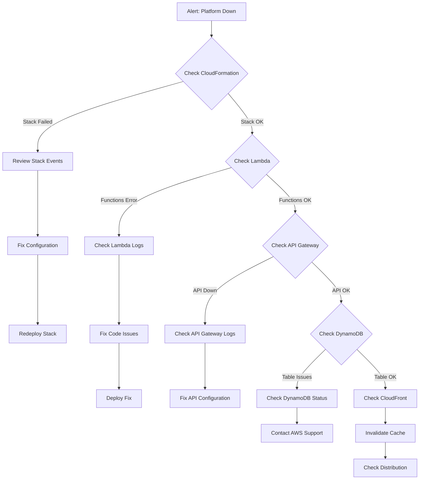

# Operating Manual

Day-to-day operations guide for the KYC platform. This manual covers routine tasks, monitoring, maintenance, and incident response.

## Table of Contents
- [Daily Operations](#daily-operations)
- [Monitoring Dashboard](#monitoring-dashboard)
- [Common Tasks](#common-tasks)
- [Incident Response](#incident-response)
- [Maintenance Windows](#maintenance-windows)
- [Backup and Recovery](#backup-and-recovery)
- [Performance Monitoring](#performance-monitoring)

## Daily Operations

### Morning Checklist

```bash
#!/bin/bash
# daily-health-check.sh

echo "KYC Platform Health Check - $(date)"
echo "========================================"

# 1. Check CloudFormation Stack Status
echo "\n1. CloudFormation Stack Status:"
aws cloudformation describe-stacks --stack-name KycStack \
  --query 'Stacks[0].StackStatus' --output text

# 2. Check Lambda Function Health
echo "\n2. Lambda Functions Status:"
for func in DocumentValidationAgent IdentityVerificationAgent FraudDetectionAgent ComplianceReportingAgent; do
  status=$(aws lambda get-function --function-name $func \
    --query 'Configuration.State' --output text 2>/dev/null)
  echo "  $func: $status"
done

# 3. Check API Gateway Health
echo "\n3. API Gateway Status:"
API_URL=$(aws cloudformation describe-stacks --stack-name KycStack \
  --query "Stacks[0].Outputs[?OutputKey=='ApiUrl'].OutputValue" --output text)
response=$(curl -s -o /dev/null -w "%{http_code}" ${API_URL}kyc)
echo "  API Response Code: $response"

# 4. Check DynamoDB Table Status
echo "\n4. DynamoDB Table Status:"
aws dynamodb describe-table --table-name KYCRecords \
  --query 'Table.TableStatus' --output text

# 5. Check S3 Buckets
echo "\n5. S3 Buckets:"
aws s3 ls | grep kyc

# 6. Check Recent Lambda Errors (last 1 hour)
echo "\n6. Lambda Errors (last 1 hour):"
for func in DocumentValidationAgent IdentityVerificationAgent FraudDetectionAgent ComplianceReportingAgent; do
  errors=$(aws logs filter-log-events \
    --log-group-name /aws/lambda/$func \
    --start-time $(($(date +%s) - 3600))000 \
    --filter-pattern "ERROR" \
    --query 'events[*].message' --output text 2>/dev/null | wc -l)
  echo "  $func: $errors errors"
done

# 7. Check Step Functions Executions (last 24 hours)
echo "\n7. Step Functions Executions (last 24 hours):"
SF_ARN=$(aws cloudformation describe-stacks --stack-name KycStack \
  --query "Stacks[0].Outputs[?OutputKey=='StateMachineArn'].OutputValue" --output text)
aws stepfunctions list-executions --state-machine-arn $SF_ARN \
  --max-results 100 | jq -r '.executions | group_by(.status) | 
  map({status: .[0].status, count: length}) | .[] | 
  "\(.status): \(.count)"'

echo "\n========================================"
echo "Health Check Complete"
```

### Key Metrics to Monitor

| Metric | Normal Range | Alert Threshold | Action Required |
|--------|--------------|-----------------|-----------------|
| Lambda Invocations | 0-1000/day | N/A | None |
| Lambda Error Rate | < 1% | > 5% | Investigate errors |
| API Gateway 5XX | 0 | > 10/hour | Check Lambda/DynamoDB |
| DynamoDB Throttles | 0 | > 5/hour | Increase capacity |
| S3 4XX Errors | < 0.1% | > 1% | Check CORS/permissions |
| Step Functions Failed | < 5% | > 10% | Check agent logic |
| Average Processing Time | < 30 sec | > 60 sec | Optimize agents |

## Monitoring Dashboard

### CloudWatch Dashboard Setup

Create a custom dashboard for real-time monitoring:

```bash
# Create CloudWatch dashboard
aws cloudwatch put-dashboard --dashboard-name KYC-Platform-Operations \
  --dashboard-body file://dashboard-config.json
```

<details>
<summary>dashboard-config.json (click to expand)</summary>

```json
{
  "widgets": [
    {
      "type": "metric",
      "properties": {
        "metrics": [
          ["AWS/Lambda", "Invocations", {"stat": "Sum", "label": "Total Invocations"}],
          [".", "Errors", {"stat": "Sum", "label": "Errors"}],
          [".", "Throttles", {"stat": "Sum", "label": "Throttles"}]
        ],
        "period": 300,
        "stat": "Sum",
        "region": "us-east-1",
        "title": "Lambda Overview",
        "yAxis": {"left": {"min": 0}}
      }
    },
    {
      "type": "metric",
      "properties": {
        "metrics": [
          ["AWS/ApiGateway", "Count", {"stat": "Sum"}],
          [".", "4XXError", {"stat": "Sum"}],
          [".", "5XXError", {"stat": "Sum"}]
        ],
        "period": 300,
        "stat": "Sum",
        "region": "us-east-1",
        "title": "API Gateway Requests"
      }
    },
    {
      "type": "metric",
      "properties": {
        "metrics": [
          ["AWS/DynamoDB", "ConsumedReadCapacityUnits", {"stat": "Sum"}],
          [".", "ConsumedWriteCapacityUnits", {"stat": "Sum"}]
        ],
        "period": 300,
        "stat": "Sum",
        "region": "us-east-1",
        "title": "DynamoDB Capacity"
      }
    },
    {
      "type": "metric",
      "properties": {
        "metrics": [
          ["AWS/States", "ExecutionsStarted", {"stat": "Sum"}],
          [".", "ExecutionsSucceeded", {"stat": "Sum"}],
          [".", "ExecutionsFailed", {"stat": "Sum"}]
        ],
        "period": 300,
        "stat": "Sum",
        "region": "us-east-1",
        "title": "Step Functions Executions"
      }
    }
  ]
}
```
</details>

### Access Dashboards

```bash
# Get CloudWatch Dashboard URL
echo "https://console.aws.amazon.com/cloudwatch/home?region=us-east-1#dashboards:name=KYC-Platform-Operations"

# Get Step Functions Dashboard
SF_ARN=$(aws cloudformation describe-stacks --stack-name KycStack \
  --query "Stacks[0].Outputs[?OutputKey=='StateMachineArn'].OutputValue" --output text)
echo "https://console.aws.amazon.com/states/home?region=us-east-1#/statemachines/view/$SF_ARN"
```

## Common Tasks

### Task 1: Process New Document Upload

**Manual Upload via CLI:**

```bash
# Step 1: Get presigned upload URL
API_URL=$(aws cloudformation describe-stacks --stack-name KycStack \
  --query "Stacks[0].Outputs[?OutputKey=='ApiUrl'].OutputValue" --output text)

UPLOAD_RESPONSE=$(curl -s -X POST ${API_URL}upload \
  -H "Content-Type: application/json" \
  -d '{"customerId":"customer-001","documentType":"passport"}')

UPLOAD_URL=$(echo $UPLOAD_RESPONSE | jq -r '.uploadUrl')

# Step 2: Upload document
curl -X PUT "$UPLOAD_URL" \
  --upload-file ./document.pdf \
  -H "Content-Type: application/pdf"

# Step 3: Monitor processing
watch -n 5 "curl -s ${API_URL}kyc/customer-001 | jq '.'"
```

### Task 2: Query KYC Records

**Get all records:**
```bash
API_URL=$(aws cloudformation describe-stacks --stack-name KycStack \
  --query "Stacks[0].Outputs[?OutputKey=='ApiUrl'].OutputValue" --output text)

curl -s ${API_URL}kyc | jq '.[] | {customerId, eventType, kycStatus, lastUpdated}'
```

**Get records for specific customer:**
```bash
curl -s ${API_URL}kyc/customer-001 | jq '.'
```

**Get records by status (requires DynamoDB query):**
```bash
aws dynamodb query --table-name KYCRecords \
  --index-name KycStatusIndex \
  --key-condition-expression "kycStatus = :status" \
  --expression-attribute-values '{":status":{"S":"COMPLETED"}}' \
  --query 'Items[*].[customerId.S, eventType.S, lastUpdated.S]' \
  --output table
```

### Task 3: View Lambda Logs

**Real-time log tailing:**
```bash
# Document Validation
aws logs tail /aws/lambda/DocumentValidationAgent --follow --format short

# Identity Verification
aws logs tail /aws/lambda/IdentityVerificationAgent --follow --format short

# All agents simultaneously (requires terminal multiplexer)
tmux new-session \; \
  split-window -h \; \
  split-window -v \; \
  select-pane -t 0 \; \
  split-window -v \; \
  select-pane -t 0 \; \
  send-keys 'aws logs tail /aws/lambda/DocumentValidationAgent --follow' C-m \; \
  select-pane -t 1 \; \
  send-keys 'aws logs tail /aws/lambda/IdentityVerificationAgent --follow' C-m \; \
  select-pane -t 2 \; \
  send-keys 'aws logs tail /aws/lambda/FraudDetectionAgent --follow' C-m \; \
  select-pane -t 3 \; \
  send-keys 'aws logs tail /aws/lambda/ComplianceReportingAgent --follow' C-m
```

**Search logs for errors:**
```bash
aws logs filter-log-events \
  --log-group-name /aws/lambda/DocumentValidationAgent \
  --filter-pattern "ERROR" \
  --start-time $(($(date +%s) - 86400))000 \
  | jq -r '.events[].message'
```

### Task 4: Manually Trigger Step Functions

```bash
# Get State Machine ARN
SF_ARN=$(aws cloudformation describe-stacks --stack-name KycStack \
  --query "Stacks[0].Outputs[?OutputKey=='StateMachineArn'].OutputValue" --output text)

# Start execution with sample input
aws stepfunctions start-execution \
  --state-machine-arn $SF_ARN \
  --name "manual-test-$(date +%s)" \
  --input '{
    "customerId": "test-customer",
    "documentUrl": "s3://bucket/key",
    "eventType": "Document.Validated",
    "isValid": true,
    "verificationScore": 0.95
  }'

# Monitor execution
aws stepfunctions describe-execution \
  --execution-arn $(aws stepfunctions list-executions \
    --state-machine-arn $SF_ARN --max-results 1 \
    --query 'executions[0].executionArn' --output text)
```

### Task 5: Clear Old Records

**Delete records older than 90 days:**

```bash
# List old records
aws dynamodb scan --table-name KYCRecords \
  --filter-expression "lastUpdated < :cutoff" \
  --expression-attribute-values "{\":cutoff\":{\"S\":\"$(date -d '90 days ago' -I)T00:00:00Z\"}}" \
  --projection-expression "customerId,eventType" \
  | jq -r '.Items[] | [.customerId.S, .eventType.S] | @tsv' \
  > old-records.txt

# Delete records (use with caution!)
while IFS=$'\t' read -r customerId eventType; do
  aws dynamodb delete-item --table-name KYCRecords \
    --key "{\"customerId\":{\"S\":\"$customerId\"},\"eventType\":{\"S\":\"$eventType\"}}"
  echo "Deleted: $customerId - $eventType"
done < old-records.txt
```

### Task 6: Generate Compliance Report

```bash
# Get all COMPLETED records
aws dynamodb query --table-name KYCRecords \
  --index-name KycStatusIndex \
  --key-condition-expression "kycStatus = :status" \
  --expression-attribute-values '{":status":{"S":"COMPLETED"}}' \
  > compliance-report-$(date +%Y%m%d).json

# Generate summary
jq -r '.Items | length as $total | 
  "Total Completed KYC: \($total)\n" +
  "Date: \(now | strftime("%Y-%m-%d"))"' \
  compliance-report-$(date +%Y%m%d).json
```

## Incident Response

### Severity Levels

| Level | Description | Response Time | Escalation |
|-------|-------------|---------------|------------|
| **P1 - Critical** | Platform down, no processing | 15 minutes | Immediate |
| **P2 - High** | Significant degradation | 1 hour | If unresolved in 2h |
| **P3 - Medium** | Minor issues, workaround available | 4 hours | If unresolved in 8h |
| **P4 - Low** | Cosmetic issues, no impact | 1 business day | None |

### Incident Response Playbook

#### P1: Platform Down



**Response Steps:**

1. **Acknowledge Incident** (< 5 minutes)
   ```bash
   # Create incident ticket
   echo "P1 Incident: $(date)" > incident-$(date +%Y%m%d-%H%M%S).txt
   ```

2. **Assess Impact** (< 10 minutes)
   ```bash
   # Run health check
   ./daily-health-check.sh > incident-health-check.txt
   ```

3. **Identify Root Cause** (< 30 minutes)
   - Check CloudWatch Alarms
   - Review recent deployments
   - Check AWS Service Health Dashboard

4. **Implement Fix** (< 1 hour)
   - Rollback recent changes if needed
   - Apply hotfix
   - Redeploy if necessary

5. **Verify Resolution** (< 15 minutes after fix)
   ```bash
   # Test end-to-end flow
   ./test-e2e.sh
   ```

6. **Post-Incident Review** (within 48 hours)
   - Document root cause
   - Identify prevention measures
   - Update runbooks

#### P2: High Error Rate

**Response Steps:**

```bash
# 1. Identify failing Lambda
aws logs insights query \
  --log-group-names \
    /aws/lambda/DocumentValidationAgent \
    /aws/lambda/IdentityVerificationAgent \
    /aws/lambda/FraudDetectionAgent \
    /aws/lambda/ComplianceReportingAgent \
  --start-time $(($(date +%s) - 3600))000 \
  --end-time $(date +%s)000 \
  --query-string 'fields @timestamp, @message
    | filter @message like /ERROR/
    | stats count() by @log
    | sort count desc'

# 2. Get recent error details
aws logs tail /aws/lambda/[FAILING_FUNCTION] \
  --since 1h --filter-pattern "ERROR" --format short

# 3. Check Lambda metrics
aws cloudwatch get-metric-statistics \
  --namespace AWS/Lambda \
  --metric-name Errors \
  --dimensions Name=FunctionName,Value=[FAILING_FUNCTION] \
  --start-time $(date -u -d '1 hour ago' +%Y-%m-%dT%H:%M:%S) \
  --end-time $(date -u +%Y-%m-%dT%H:%M:%S) \
  --period 300 \
  --statistics Sum

# 4. If persistent, consider rolling back
# See Deployment Guide for rollback procedures
```

## Maintenance Windows

### Scheduled Maintenance

**Best Time:** Sunday 2:00 AM - 4:00 AM UTC (lowest traffic)

**Pre-Maintenance Checklist:**

```bash
#!/bin/bash
# pre-maintenance.sh

echo "Pre-Maintenance Checklist"
echo "========================="

# 1. Backup DynamoDB
echo "1. Creating DynamoDB backup..."
aws dynamodb create-backup \
  --table-name KYCRecords \
  --backup-name "KYCRecords-maintenance-$(date +%Y%m%d)"

# 2. Document current state
echo "2. Documenting current state..."
aws cloudformation describe-stacks --stack-name KycStack > pre-maintenance-state.json

# 3. Verify all functions are healthy
echo "3. Verifying function health..."
./daily-health-check.sh > pre-maintenance-health.txt

# 4. Notify stakeholders
echo "4. Send maintenance notification"
# Add notification logic (email, Slack, etc.)

echo "Pre-maintenance checklist complete!"
```

**Post-Maintenance Checklist:**

```bash
#!/bin/bash
# post-maintenance.sh

echo "Post-Maintenance Checklist"
echo "=========================="

# 1. Verify stack status
echo "1. Verifying stack status..."
aws cloudformation describe-stacks --stack-name KycStack \
  --query 'Stacks[0].StackStatus' --output text

# 2. Run health check
echo "2. Running health check..."
./daily-health-check.sh

# 3. Test end-to-end workflow
echo "3. Testing end-to-end workflow..."
./test-e2e.sh

# 4. Compare with pre-maintenance state
echo "4. Comparing with pre-maintenance state..."
diff pre-maintenance-state.json \
  <(aws cloudformation describe-stacks --stack-name KycStack)

# 5. Notify stakeholders
echo "5. Send maintenance complete notification"

echo "Post-maintenance checklist complete!"
```

### Emergency Rollback

```bash
#!/bin/bash
# emergency-rollback.sh

echo "EMERGENCY ROLLBACK"
echo "=================="

# 1. Get current stack template
aws cloudformation get-template \
  --stack-name KycStack \
  --query 'TemplateBody' > current-template.json

# 2. List available backups
echo "Available DynamoDB backups:"
aws dynamodb list-backups --table-name KYCRecords

# 3. Rollback CDK (if needed)
cd infrastructure
git log --oneline -n 10
echo "Enter commit hash to rollback to:"
read commit_hash
git checkout $commit_hash
cdk deploy --require-approval never

# 4. Restore DynamoDB (if needed)
echo "Enter backup ARN to restore (or 'skip'):"
read backup_arn
if [ "$backup_arn" != "skip" ]; then
  aws dynamodb restore-table-from-backup \
    --target-table-name KYCRecords-restored \
    --backup-arn $backup_arn
fi

echo "Rollback complete. Verify system health!"
```

## Backup and Recovery

### Automated Backups

**DynamoDB Point-in-Time Recovery:**
- Enabled by default
- Retains changes for 35 days
- Zero-impact on performance

**Manual Backup:**
```bash
# Create on-demand backup
aws dynamodb create-backup \
  --table-name KYCRecords \
  --backup-name "KYCRecords-$(date +%Y%m%d-%H%M%S)"

# List backups
aws dynamodb list-backups --table-name KYCRecords

# Restore from backup
aws dynamodb restore-table-from-backup \
  --target-table-name KYCRecords-restored \
  --backup-arn arn:aws:dynamodb:region:account:table/KYCRecords/backup/xxx
```

### S3 Versioning

S3 documents bucket has versioning enabled:

```bash
# List object versions
aws s3api list-object-versions \
  --bucket kyc-documents-${ACCOUNT}-${REGION} \
  --prefix uploads/customer-001/

# Restore previous version
aws s3api copy-object \
  --bucket kyc-documents-${ACCOUNT}-${REGION} \
  --copy-source kyc-documents-${ACCOUNT}-${REGION}/key?versionId=VERSION_ID \
  --key uploads/customer-001/document.pdf
```

## Performance Monitoring

### Key Performance Indicators (KPIs)

```bash
#!/bin/bash
# generate-kpi-report.sh

echo "KYC Platform KPI Report - $(date)"
echo "===================================="

# 1. Average processing time (Step Functions)
SF_ARN=$(aws cloudformation describe-stacks --stack-name KycStack \
  --query "Stacks[0].Outputs[?OutputKey=='StateMachineArn'].OutputValue" --output text)

echo "\n1. Average Processing Time (last 24 hours):"
aws stepfunctions list-executions --state-machine-arn $SF_ARN \
  --max-results 100 | jq -r '.executions[] | 
  select(.status == "SUCCEEDED") | 
  {start: .startDate, stop: .stopDate} | 
  (.stop - .start) / 1000' | \
  awk '{sum+=$1; count++} END {printf "  Average: %.2f seconds\n", sum/count}'

# 2. Success rate
echo "\n2. Success Rate (last 24 hours):"
aws stepfunctions list-executions --state-machine-arn $SF_ARN \
  --max-results 100 | jq -r '.executions | 
  group_by(.status) | 
  map({status: .[0].status, count: length}) | 
  {total: (map(.count) | add), succeeded: (map(select(.status == "SUCCEEDED").count) // [0] | add)} | 
  "  Success Rate: \((.succeeded / .total * 100) | round)%"'

# 3. Lambda performance
echo "\n3. Lambda Performance (last hour):"
for func in DocumentValidationAgent IdentityVerificationAgent FraudDetectionAgent ComplianceReportingAgent; do
  avg_duration=$(aws cloudwatch get-metric-statistics \
    --namespace AWS/Lambda \
    --metric-name Duration \
    --dimensions Name=FunctionName,Value=$func \
    --start-time $(date -u -d '1 hour ago' +%Y-%m-%dT%H:%M:%S) \
    --end-time $(date -u +%Y-%m-%dT%H:%M:%S) \
    --period 3600 \
    --statistics Average \
    --query 'Datapoints[0].Average' --output text)
  echo "  $func: ${avg_duration} ms"
done

# 4. API Gateway latency
echo "\n4. API Gateway Latency (last hour):"
aws cloudwatch get-metric-statistics \
  --namespace AWS/ApiGateway \
  --metric-name Latency \
  --dimensions Name=ApiName,Value="KYC Service API" \
  --start-time $(date -u -d '1 hour ago' +%Y-%m-%dT%H:%M:%S) \
  --end-time $(date -u +%Y-%m-%dT%H:%M:%S) \
  --period 3600 \
  --statistics Average \
  --query 'Datapoints[0].Average' --output text | \
  awk '{printf "  Average: %.2f ms\n", $1}'

echo "\n===================================="
```

### Performance Optimization Tips

See [Performance Tuning Guide](./16-performance-tuning.md) for detailed optimization strategies.

## Next Steps

- [Monitoring Guide](./12-monitoring.md) - Detailed monitoring setup
- [Troubleshooting Guide](./13-troubleshooting.md) - Common issues and solutions
- [Disaster Recovery](./18-disaster-recovery.md) - Business continuity planning
- [Performance Tuning](./16-performance-tuning.md) - Optimization strategies
