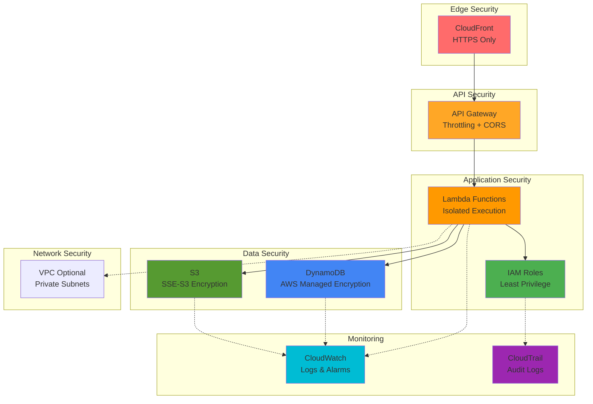
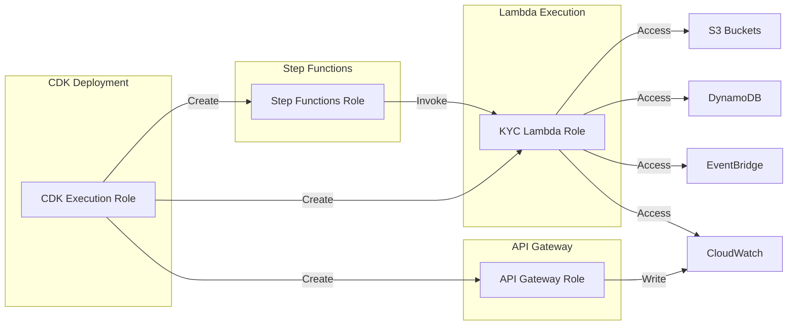
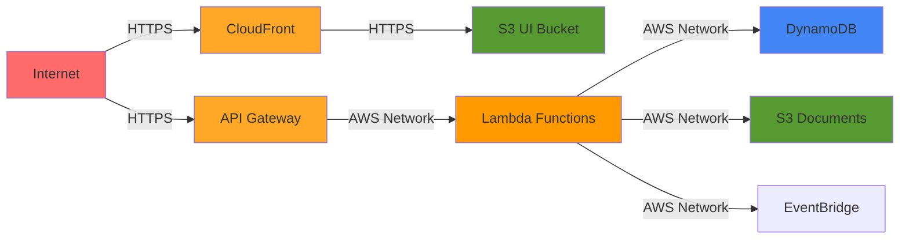
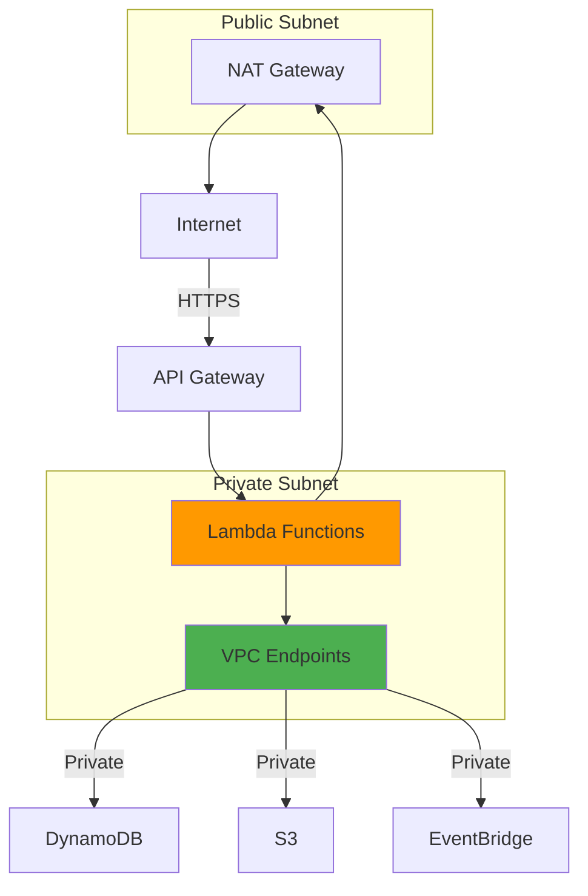

# Security & IAM Guide

Comprehensive security and Identity & Access Management (IAM) documentation for the KYC platform.

## Table of Contents
- [Security Overview](#security-overview)
- [IAM Roles & Policies](#iam-roles--policies)
- [Encryption](#encryption)
- [Network Security](#network-security)
- [Compliance](#compliance)
- [Security Best Practices](#security-best-practices)
- [Audit & Monitoring](#audit--monitoring)

## Security Overview

The KYC platform implements **defense-in-depth** security with multiple layers of protection:



### Security Principles

1. **Least Privilege**: Minimum permissions required
2. **Encryption Everywhere**: Data at rest and in transit
3. **Defense in Depth**: Multiple security layers
4. **Audit Everything**: Complete logging and monitoring
5. **Assume Breach**: Design for containment

## IAM Roles & Policies

### Architecture Overview



### 1. Lambda Execution Role

**Role Name**: `KycStack-KycLambdaRole{randomId}`

**Trust Policy**:
```json
{
  "Version": "2012-10-17",
  "Statement": [
    {
      "Effect": "Allow",
      "Principal": {
        "Service": "lambda.amazonaws.com"
      },
      "Action": "sts:AssumeRole"
    }
  ]
}
```

**Managed Policies**:
- `arn:aws:iam::aws:policy/service-role/AWSLambdaBasicExecutionRole`

**Inline Policies**:

```json
{
  "Version": "2012-10-17",
  "Statement": [
    {
      "Sid": "S3DocumentAccess",
      "Effect": "Allow",
      "Action": [
        "s3:GetObject",
        "s3:PutObject",
        "s3:DeleteObject"
      ],
      "Resource": "arn:aws:s3:::kyc-documents-*/*"
    },
    {
      "Sid": "DynamoDBAccess",
      "Effect": "Allow",
      "Action": [
        "dynamodb:PutItem",
        "dynamodb:GetItem",
        "dynamodb:UpdateItem",
        "dynamodb:Query",
        "dynamodb:Scan"
      ],
      "Resource": [
        "arn:aws:dynamodb:*:*:table/KYCRecords",
        "arn:aws:dynamodb:*:*:table/KYCRecords/index/*"
      ]
    },
    {
      "Sid": "EventBridgeAccess",
      "Effect": "Allow",
      "Action": [
        "events:PutEvents"
      ],
      "Resource": "arn:aws:events:*:*:event-bus/kyc-event-bus"
    },
    {
      "Sid": "CloudWatchLogs",
      "Effect": "Allow",
      "Action": [
        "logs:CreateLogGroup",
        "logs:CreateLogStream",
        "logs:PutLogEvents"
      ],
      "Resource": "arn:aws:logs:*:*:log-group:/aws/lambda/*"
    }
  ]
}
```

### 2. Step Functions Execution Role

**Role Name**: `KycStack-KycStateMachineRole{randomId}`

**Trust Policy**:
```json
{
  "Version": "2012-10-17",
  "Statement": [
    {
      "Effect": "Allow",
      "Principal": {
        "Service": "states.amazonaws.com"
      },
      "Action": "sts:AssumeRole"
    }
  ]
}
```

**Inline Policy**:
```json
{
  "Version": "2012-10-17",
  "Statement": [
    {
      "Sid": "InvokeLambda",
      "Effect": "Allow",
      "Action": [
        "lambda:InvokeFunction"
      ],
      "Resource": [
        "arn:aws:lambda:*:*:function:DocumentValidationAgent",
        "arn:aws:lambda:*:*:function:IdentityVerificationAgent",
        "arn:aws:lambda:*:*:function:FraudDetectionAgent",
        "arn:aws:lambda:*:*:function:ComplianceReportingAgent"
      ]
    },
    {
      "Sid": "CloudWatchLogs",
      "Effect": "Allow",
      "Action": [
        "logs:CreateLogDelivery",
        "logs:GetLogDelivery",
        "logs:UpdateLogDelivery",
        "logs:DeleteLogDelivery",
        "logs:ListLogDeliveries",
        "logs:PutResourcePolicy",
        "logs:DescribeResourcePolicies",
        "logs:DescribeLogGroups"
      ],
      "Resource": "*"
    }
  ]
}
```

### 3. API Gateway CloudWatch Role

**Role Name**: `KycStack-ApiGatewayCloudWatchRole{randomId}`

**Trust Policy**:
```json
{
  "Version": "2012-10-17",
  "Statement": [
    {
      "Effect": "Allow",
      "Principal": {
        "Service": "apigateway.amazonaws.com"
      },
      "Action": "sts:AssumeRole"
    }
  ]
}
```

**Managed Policy**:
- `arn:aws:iam::aws:policy/service-role/AmazonAPIGatewayPushToCloudWatchLogs`

### 4. CDK Deployment Role

For users deploying the infrastructure, see the complete IAM policy in [IAM-PERMISSIONS-REQUIRED.md](../IAM-PERMISSIONS-REQUIRED.md).

**Minimum Required Permissions**:
```json
{
  "Version": "2012-10-17",
  "Statement": [
    {
      "Sid": "CDKBootstrap",
      "Effect": "Allow",
      "Action": [
        "cloudformation:*",
        "ecr:*",
        "s3:*",
        "ssm:*",
        "iam:*"
      ],
      "Resource": "*"
    },
    {
      "Sid": "ServiceCreation",
      "Effect": "Allow",
      "Action": [
        "lambda:*",
        "dynamodb:*",
        "events:*",
        "states:*",
        "apigateway:*",
        "logs:*",
        "cloudfront:*"
      ],
      "Resource": "*"
    }
  ]
}
```

## Encryption

### Data at Rest

#### S3 Encryption

```yaml
Encryption Type: Server-Side Encryption (SSE-S3)
Algorithm: AES-256
Key Management: AWS Managed
Rotation: Automatic

Configuration:
  - Documents Bucket: Enabled
  - UI Bucket: Enabled
  - Versioning: Enabled (documents only)

CDK Configuration:
encryption: s3.BucketEncryption.S3_MANAGED
```

#### DynamoDB Encryption

```yaml
Encryption Type: AWS Managed Encryption
Key: AWS owned customer master key (CMK)
Rotation: Automatic

Configuration:
  - Table: KYCRecords
  - Indexes: All GSIs encrypted
  - Streams: Encrypted

CDK Configuration:
encryption: dynamodb.TableEncryption.AWS_MANAGED
```

#### CloudWatch Logs Encryption

```yaml
Encryption: AWS Managed
Status: Encrypted at rest
Key: AWS managed key for CloudWatch Logs

All log groups automatically encrypted
```

### Data in Transit

```yaml
Protocol: TLS 1.2 or higher
Minimum Version: TLSv1.2_2021

Endpoints:
  - CloudFront: HTTPS only (HTTP → HTTPS redirect)
  - API Gateway: HTTPS only
  - Lambda: Internal AWS network (encrypted)
  - DynamoDB: HTTPS API calls
  - S3: HTTPS API calls
  - EventBridge: Internal AWS network (encrypted)

Certificate:
  CloudFront: AWS Certificate Manager (ACM) or default CloudFront cert
  API Gateway: Default AWS certificate
```

### Presigned URL Security

```javascript
// API Handler generates presigned URLs with:
const presignedUrl = await getSignedUrl(s3Client, command, {
  expiresIn: 3600 // 1 hour expiration
});

// Security features:
// 1. Time-limited (1 hour)
// 2. Single-use URL
// 3. HTTPS only
// 4. No credential exposure
```

## Network Security

### Current Architecture (Public Lambda)



**Security Features**:
- ✅ No public internet access to data stores
- ✅ All traffic encrypted (TLS/HTTPS)
- ✅ API Gateway throttling and rate limiting
- ✅ CloudFront DDoS protection
- ✅ S3 block public access enabled

### Enhanced Architecture (VPC Lambda) - Optional



**To Enable VPC** (increases cost):

```typescript
// In infrastructure/lib/kyc-stack.ts
const vpc = new ec2.Vpc(this, 'KycVpc', {
  maxAzs: 2,
  natGateways: 1
});

const lambda = new lambda.Function(this, 'Agent', {
  // ... other config
  vpc,
  vpcSubnets: { subnetType: ec2.SubnetType.PRIVATE_WITH_EGRESS }
});
```

**VPC Endpoints** (reduce NAT Gateway costs):

```typescript
vpc.addInterfaceEndpoint('DynamoDBEndpoint', {
  service: ec2.InterfaceVpcEndpointAwsService.DYNAMODB
});

vpc.addGatewayEndpoint('S3Endpoint', {
  service: ec2.GatewayVpcEndpointAwsService.S3
});
```

### CORS Configuration

```javascript
// API Gateway CORS
defaultCorsPreflightOptions: {
  allowOrigins: ['https://your-domain.com'], // Restrict in production
  allowMethods: ['GET', 'POST', 'PUT', 'DELETE', 'OPTIONS'],
  allowHeaders: ['Content-Type', 'X-Api-Key', 'Authorization'],
  allowCredentials: false,
  maxAge: Duration.minutes(10)
}

// S3 CORS (for direct uploads)
cors: [
  {
    allowedMethods: [s3.HttpMethods.GET, s3.HttpMethods.PUT, s3.HttpMethods.POST],
    allowedOrigins: ['https://your-domain.com'], // Restrict in production
    allowedHeaders: ['*'],
    exposedHeaders: ['ETag', 'x-amz-server-side-encryption'],
    maxAge: 3000
  }
]
```

## Compliance

### Standards & Frameworks

| Standard | Compliance Level | Notes |
|----------|------------------|-------|
| **GDPR** | Partial | Data retention policies needed |
| **SOC 2** | Framework ready | Audit logging in place |
| **ISO 27001** | Framework ready | Security controls implemented |
| **PCI DSS** | Not applicable | No credit card data |
| **HIPAA** | Configurable | Enable encryption with CMK |

### GDPR Compliance

**Right to Erasure**:
```bash
# Delete customer data
CUSTOMER_ID="customer-001"

# 1. Delete from DynamoDB
aws dynamodb query --table-name KYCRecords \
  --key-condition-expression "customerId = :id" \
  --expression-attribute-values '{":id":{"S":"'$CUSTOMER_ID'"}}' \
  --projection-expression "customerId,eventType" \
  | jq -r '.Items[] | [.customerId.S, .eventType.S] | @tsv' \
  | while IFS=$'\t' read -r cid etype; do
      aws dynamodb delete-item --table-name KYCRecords \
        --key "{\"customerId\":{\"S\":\"$cid\"},\"eventType\":{\"S\":\"$etype\"}}"
    done

# 2. Delete from S3
aws s3 rm s3://kyc-documents-${ACCOUNT}-${REGION}/uploads/$CUSTOMER_ID/ --recursive
aws s3 rm s3://kyc-documents-${ACCOUNT}-${REGION}/reports/$CUSTOMER_ID/ --recursive
```

**Data Retention**:
```typescript
// In infrastructure/lib/kyc-stack.ts
lifecycleRules: [
  {
    expiration: cdk.Duration.days(90), // Adjust as needed
    id: 'DeleteOldDocuments'
  }
]
```

### Data Residency

```yaml
Default Region: us-east-1

To Change Region:
  1. Update infrastructure/bin/kyc-app.ts
  2. Specify region in CDK stack
  3. Redeploy

Example:
  env: {
    region: 'eu-west-1', // Ireland for EU data residency
    account: process.env.CDK_DEFAULT_ACCOUNT
  }
```

## Security Best Practices

### 1. Production Hardening Checklist

```bash
#!/bin/bash
# security-hardening.sh

echo "Security Hardening Checklist"
echo "============================"

# 1. Enable CloudTrail
echo "✓ Enable CloudTrail for API logging"
aws cloudtrail create-trail \
  --name kyc-platform-trail \
  --s3-bucket-name kyc-cloudtrail-logs

# 2. Enable AWS Config
echo "✓ Enable AWS Config for compliance monitoring"
aws configservice put-configuration-recorder \
  --configuration-recorder name=default,roleARN=arn:aws:iam::ACCOUNT:role/config-role

# 3. Set up CloudWatch Alarms
echo "✓ Create CloudWatch Alarms for anomalies"
aws cloudwatch put-metric-alarm \
  --alarm-name lambda-errors-high \
  --alarm-description "Alert on high Lambda error rate" \
  --metric-name Errors \
  --namespace AWS/Lambda \
  --statistic Sum \
  --period 300 \
  --threshold 10 \
  --comparison-operator GreaterThanThreshold

# 4. Enable GuardDuty
echo "✓ Enable GuardDuty for threat detection"
aws guardduty create-detector --enable

# 5. Enable MFA Delete on S3
echo "✓ Enable MFA Delete on S3 buckets (requires root account)"
# aws s3api put-bucket-versioning \
#   --bucket kyc-documents-* \
#   --versioning-configuration Status=Enabled,MFADelete=Enabled \
#   --mfa "arn:aws:iam::ACCOUNT:mfa/root-account-mfa-device TOKENCODE"

# 6. Restrict API Gateway
echo "✓ Add API Gateway resource policy"
# Configure API key or Cognito authentication

# 7. Enable S3 Access Logging
echo "✓ Enable S3 access logging"
aws s3api put-bucket-logging \
  --bucket kyc-documents-* \
  --bucket-logging-status \
    '{"LoggingEnabled":{"TargetBucket":"kyc-access-logs","TargetPrefix":"documents/"}}'

echo "Hardening complete!"
```

### 2. Secrets Management

**Never commit secrets to code!**

```bash
# Use AWS Secrets Manager for sensitive data
aws secretsmanager create-secret \
  --name kyc/fraud-detection/api-key \
  --secret-string "your-api-key-here"

# Access in Lambda:
# const secret = await secretsManager.getSecretValue({ SecretId: 'kyc/fraud-detection/api-key' }).promise();
```

### 3. API Authentication (Production)

**Add API Key Authentication**:

```typescript
// In infrastructure/lib/kyc-stack.ts
const apiKey = api.addApiKey('KycApiKey', {
  apiKeyName: 'kyc-platform-key',
  value: 'generate-strong-key-here'
});

const usagePlan = api.addUsagePlan('KycUsagePlan', {
  throttle: {
    rateLimit: 100,
    burstLimit: 200
  },
  quota: {
    limit: 10000,
    period: apigateway.Period.DAY
  }
});

usagePlan.addApiKey(apiKey);
usagePlan.addApiStage({ stage: api.deploymentStage });
```

**Or Add Cognito Authentication**:

```typescript
const userPool = new cognito.UserPool(this, 'KycUserPool');

const auth = new apigateway.CognitoUserPoolsAuthorizer(this, 'KycAuth', {
  cognitoUserPools: [userPool]
});

api.root.addMethod('GET', integration, {
  authorizer: auth,
  authorizationType: apigateway.AuthorizationType.COGNITO
});
```

### 4. Rate Limiting

```typescript
// API Gateway throttling (configured in CDK)
deployOptions: {
  throttle: {
    rateLimit: 100,   // requests per second
    burstLimit: 200   // burst capacity
  }
}
```

### 5. Input Validation

```java
// In Lambda agents
private void validateInput(String input) {
    if (input == null || input.trim().isEmpty()) {
        throw new IllegalArgumentException("Input cannot be empty");
    }
    
    // Prevent injection attacks
    if (input.contains("<script>") || input.contains("javascript:")) {
        throw new IllegalArgumentException("Invalid input detected");
    }
    
    // Limit size
    if (input.length() > 1000) {
        throw new IllegalArgumentException("Input too large");
    }
}
```

## Audit & Monitoring

### CloudTrail

```bash
# Enable CloudTrail
aws cloudtrail create-trail \
  --name kyc-platform-audit \
  --s3-bucket-name kyc-audit-logs

aws cloudtrail start-logging --name kyc-platform-audit

# Query CloudTrail logs
aws cloudtrail lookup-events \
  --lookup-attributes AttributeKey=ResourceName,AttributeValue=KYCRecords \
  --max-results 10
```

### AWS Config

```bash
# Enable AWS Config
aws configservice put-configuration-recorder \
  --configuration-recorder name=default,roleARN=arn:aws:iam::ACCOUNT:role/config-role

# Check S3 bucket encryption
aws configservice describe-compliance-by-config-rule \
  --config-rule-names s3-bucket-server-side-encryption-enabled
```

### Security Hub

```bash
# Enable Security Hub
aws securityhub enable-security-hub

# Get security findings
aws securityhub get-findings \
  --filters '{"ResourceType":[{"Value":"AwsLambdaFunction","Comparison":"EQUALS"}]}'
```

### GuardDuty

```bash
# Enable GuardDuty
aws guardduty create-detector --enable

# Get findings
DETECTOR_ID=$(aws guardduty list-detectors --query 'DetectorIds[0]' --output text)
aws guardduty list-findings --detector-id $DETECTOR_ID
```

## Security Incident Response

### 1. Suspected Breach

```bash
#!/bin/bash
# incident-response.sh

echo "SECURITY INCIDENT RESPONSE"
echo "=========================="

# 1. Isolate affected resources
echo "Step 1: Isolating resources..."
# Disable Lambda functions
aws lambda update-function-configuration \
  --function-name DocumentValidationAgent \
  --environment Variables={DISABLED=true}

# 2. Capture logs immediately
echo "Step 2: Capturing logs..."
aws logs create-export-task \
  --log-group-name /aws/lambda/DocumentValidationAgent \
  --from $(date -d '24 hours ago' +%s)000 \
  --to $(date +%s)000 \
  --destination kyc-incident-logs \
  --destination-prefix incident-$(date +%Y%m%d)

# 3. Review CloudTrail
echo "Step 3: Reviewing CloudTrail..."
aws cloudtrail lookup-events \
  --start-time $(date -d '24 hours ago' +%Y-%m-%dT%H:%M:%S) \
  --max-results 1000 \
  > incident-cloudtrail.json

# 4. Check IAM
echo "Step 4: Checking IAM activity..."
aws cloudtrail lookup-events \
  --lookup-attributes AttributeKey=EventName,AttributeValue=CreateAccessKey \
  > incident-iam-activity.json

# 5. Rotate credentials
echo "Step 5: Rotating credentials..."
# Rotate API keys, secrets, etc.

echo "Incident response initiated. Contact security team!"
```

### 2. Data Leak Response

1. **Immediate Actions**:
   - Revoke all presigned URLs
   - Block public access to S3
   - Disable API Gateway
   - Review CloudTrail for unauthorized access

2. **Investigation**:
   - Analyze CloudTrail logs
   - Check S3 access logs
   - Review API Gateway logs
   - Identify scope of breach

3. **Remediation**:
   - Patch vulnerabilities
   - Rotate all credentials
   - Notify affected parties (GDPR requirement)
   - Update security controls

## Next Steps

- [Operating Manual](./11-operating-manual.md) - Day-to-day operations
- [Monitoring Guide](./12-monitoring.md) - Set up monitoring
- [Compliance Documentation](./18-disaster-recovery.md) - Business continuity
- [AWS Services](./06-aws-services.md) - Service configurations
